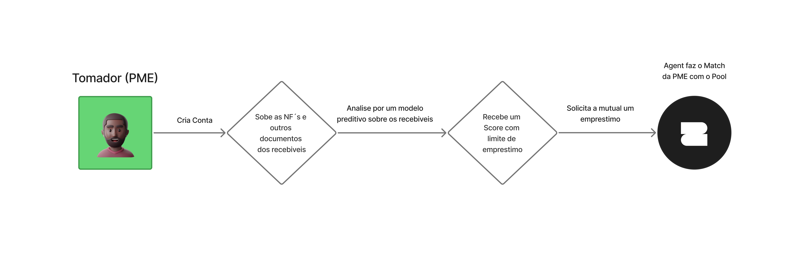
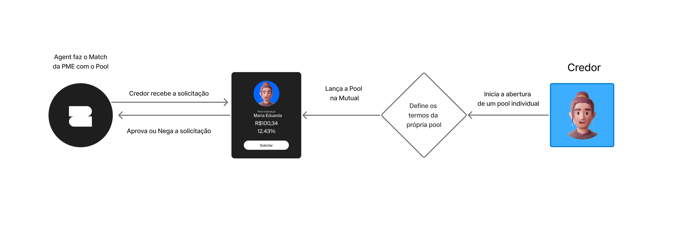
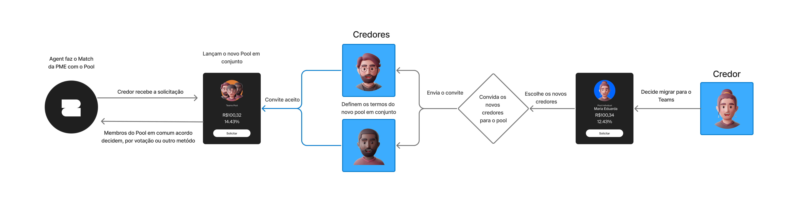
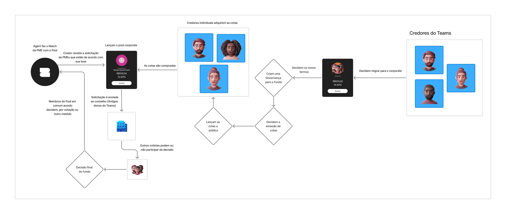
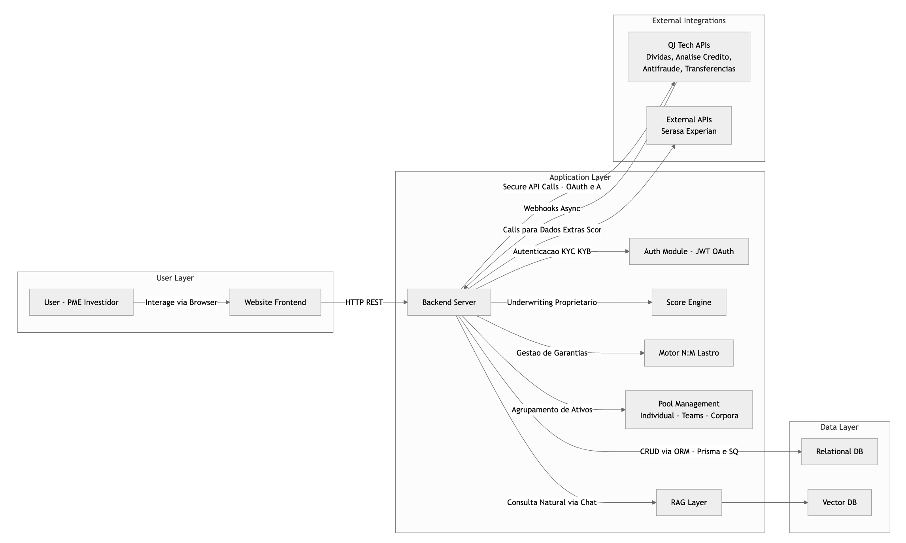
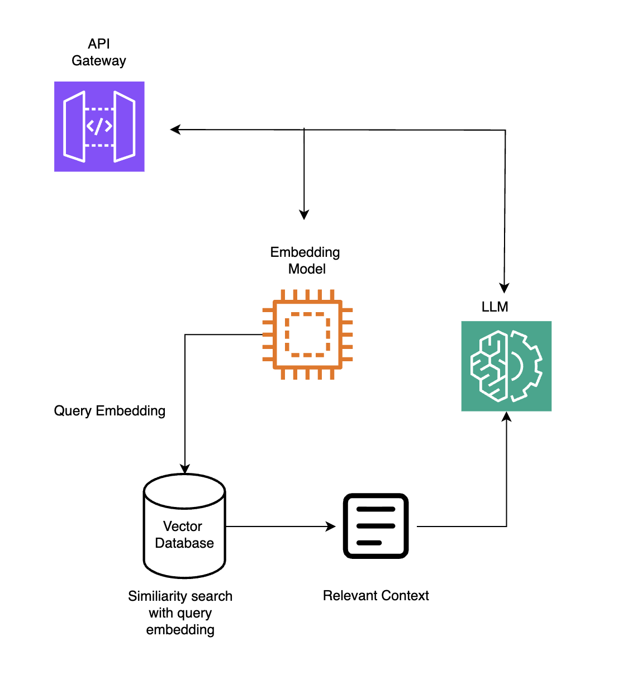
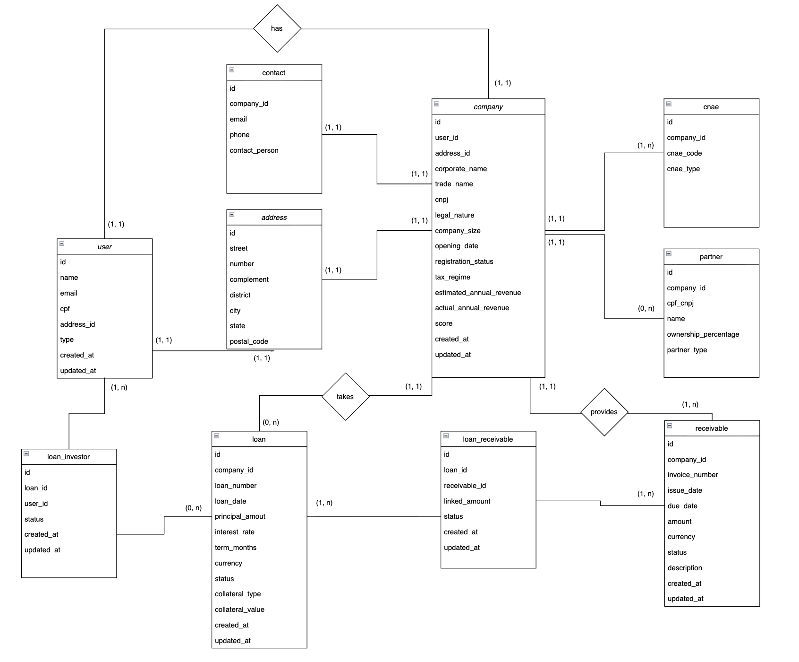

## 🔗 Sumário

1. [Resumo Executivo & Introdução](#1-resumo-executivo--introdução)  
2. [Problema a Ser Resolvido](#2-problema-a-ser-resolvido)  
3. [Público-Alvo & Personas](#3-público-alvo--personas)  
4. [Análise de Mercado](#4-análise-de-mercado)  
5. [Análise SWOT](#5-análise-swot)  
6. [Visão Geral da Solução](#6-visão-geral-da-solução)  
7. [Arquitetura Técnica](#7-arquitetura-técnica)  
8. [Diferenciais e Inovação](#8-diferenciais-e-inovação)  
9. [Funcionalidades & MVP](#9-funcionalidades--mvp)  
10. [Modelo de Negócios & Monetização](#10-modelo-de-negócios--monetização)    
11. [Indicadores de Sucesso & Impacto](#11-indicadores-de-sucesso--impacto)  
12. [Roadmap & Visão de Futuro](#12-roadmap--visão-de-futuro)  
13. [Equipe e Papéis](#13-equipe-e-papéis)  
14. [Referências & Apêndices](#14-referências--apêndices)

---

## 1. Resumo Executivo & Introdução

O Mutual é a proposta de um Marketplace de Crédito Peer-to-Peer (P2P) que resolve a ineficiência do capital no Brasil ao transformar o fluxo de recebíveis de PMEs em um ativo de crédito institucional seguro. Nossa solução é um MVP coeso que inova ao utilizar a SCD/DTVM/Custódia da QI Tech como seu único e inegociável pilar de infraestrutura.

O Mutual oferece benefícios claros a todos os participantes:

* Para PMEs (Tomadores): Acesso a crédito em minutos via Chatbot, com underwriting justo baseado no Score Híbrido proprietário (que prioriza 70% o fluxo de recebíveis sobre o score tradicional).

* Para Investidores (Credores): Acesso a pools de ativos de dívida com segurança jurídica inédita, garantida pelo registro da cessão fiduciária via Custódia (DTVM), eliminando o risco de duplicidade de lastro (Motor N:M).

O projeto está perfeitamente alinhado com a missão da QI Tech de ser o All-in-one para serviços financeiros. Ao focar na SCD/DTVM, o Mutual prova o valor estratégico da QI Tech como a infraestrutura legal que transforma ideias em produtos regulados e escaláveis, utilizando o Modelo de Performance Fee sobre o Lucro para atrair e reter grandes volumes de capital institucional.
---

## 2. Problema a Ser Resolvido

O Mutual é uma solução criada para resolver a ineficiência no mercado de crédito que afeta diretamente as Pequenas e Médias Empresas (PMEs). Este segmento, que impulsiona a economia brasileira ao gerar aproximadamente 30% do Produto Interno Bruto (PIB) (MCKINSEY, 2022), é o mais penalizado pela estrutura de crédito tradicional.

### 2.1. Desafios Atuais do Mercado de Crédito: Centralização, Custo e Lentidão

O sistema financeiro tradicional impõe barreiras significativas que impedem as PMEs de acessarem o capital de giro necessário para crescer:

| Desafio                    | Detalhamento com Dados de Mercado e Foco em PME                                                                                             |
|----------------------------|------------------------------------------------------------------------------------------------------------------------------------------|
| Lentidão e Burocracia na Análise    | O processo de underwriting é desproporcional à necessidade de velocidade das PMEs. Apenas três em cada dez donos de pequenos negócios que buscaram empréstimos conseguiram obter crédito, refletindo a baixa taxa de sucesso e a morosidade do processo (SEBRAE, 2023).  |
| Centralização e Baixa Inclusão       | O crédito para o segmento de PMEs é drasticamente sub-servido, representando historicamente apenas 9% do volume total emprestado no país (MCKINSEY, 2022). Essa concentração afasta as PMEs que não se encaixam no perfil de risco dos grandes bancos.                             |
| Alto Spread e Falta de Garantias Líquidas | O alto custo do crédito é imposto, em parte, pela ineficiência do modelo tradicional (FECOMERCIO, 2025). Além disso, PMEs com bons recebíveis (parcelamentos de clientes, contratos) lutam para usar esse ativo como garantia de forma ágil, pois o sistema é avesso a modelos de lastro flexíveis. |

### 2.2. Especificidades do P2P e os Gargalos de Segurança e Confiabilidade

O modelo Peer-to-Peer (P2P), embora mais eficiente, exige uma solução robusta para proteger as operações de PMEs e o capital dos investidores:
- **Gargalo de Integridade do Lastro:** Para PMEs que cedem recebíveis como garantia, o risco de usar o mesmo ativo em múltiplas transações (duplicidade) é real. A confiança no crédito lastreado depende de uma estrutura tecnológica que garanta o controle da garantia via Registradora.
- **Gargalo de Confiança e Risco:** Investidores que financiam PMEs exigem transparência e validação rigorosa. A plataforma deve ter um Sistema de Score de Crédito que vá além do scoring tradicional (que tende a penalizar PMEs) para construir confiança no ativo P2P.
- **Gargalo de Liquidez (Investidor):** Para atrair capital de investidores qualificados, o dinheiro não pode ficar parado (pledge inativo). A ineficiência de capital afeta a atratividade do modelo P2P.

### 2.3. Valor Agregado da Solução Mutual (Foco PME)

O Mutual inova ao utilizar tecnologia como um SCD, resolvendo os problemas de lentidão e risco do mercado de PMEs por meio de:

| Inovação do Mutual  | Benefício e Impacto para a PME                                                                                                                                                   |
|------------------------|-----------------------------------------------------------------------------------------------------------------------------------------------------------------------------------|
| Decisão Imediata (Score Híbrido) | Permite que a PME saiba em segundos o limite e a taxa de seu crédito lastreado. O Score Híbrido avalia o fluxo de recebíveis, tornando o risco mais justo para empresas que, de outra forma, teriam o crédito negado (SEBRAE, 2023).  |
| Motor de Lastro N:M e Registradora | Oferece flexibilidade máxima para a PME, permitindo que múltiplos recebíveis sirvam de garantia para múltiplos empréstimos. O controle rigoroso, com segurança antifraude, garante a integridade e a confiança no lastro.              |
| Mecanismo de Ativação P2P        | Garante que o Investidor seja atraído pela eficiência de capital, o que se traduz em um custo de captação menor para a PME no longo prazo.                                                                                   |
| UX de Crédito Onipresente         | Transforma o processo de crédito em uma jornada Chatbot fácil e intuitiva, eliminando a burocracia física e acelerando o acesso ao capital. 

## 3. Público-Alvo & Personas

O Mutual atende a um marketplace de duas pontas: a PME Tomadora de Crédito (demandante de capital) e o Investidor Qualificado (provedor de capital).

---

### 3.1. Público-Alvo Principal: PMEs Lastreadas (Tomador de Crédito)

Focamos em PMEs de Varejo e Serviços com faturamento que exige agilidade e que possuem recebíveis futuros (cartão de crédito, contratos) como garantia.

#### Persona 1: Ana Lúcia - A PME Digital (Tomadora)

| Tópico        | Detalhe                                                                                     |
|---------------|--------------------------------------------------------------------------------------------|
| Quem é?       | Dona de um e-commerce de Moda (12 funcionários). Faturamento anual de R$ 1,5 milhão. Vendas concentradas em cartão de crédito e marketplaces. |
| Motivação     | Aproveitar oportunidades de compra de estoque, necessitando capital de giro imediato para não perder o preço de atacado.                   |
| Dores         | 1. Lentidão do Banco: Processo de 15 dias para análise de crédito.   2. Alto Custo: Taxas injustas para empresas digitais com fluxo sólido. |
| Como o Mutual Ajuda | 1. Decisão em Segundos: Solicitação via Chatbot/WhatsApp com aprovação quase instantânea.   2. Score Híbrido: Valoriza o fluxo de recebíveis (lastro) para garantir taxas justas. |

---

### 3.2. Público-Alvo Secundário: Investidores (Credores)

Miramos em Pessoas Físicas Qualificadas que buscam ativos de crédito alternativos com alto yield, mas que exigem a transparência e a segurança jurídica de nível institucional.

#### Persona 2: Ricardo - O Investidor Qualificado (Credor - Pessoa Física)

| Tópico       | Detalhe                                                                                                                     |
|--------------|----------------------------------------------------------------------------------------------------------------------------|
| Quem é?      | Profissional liberal (CPF) com patrimônio acima de R$ 300 mil. Busca alocar capital para rendimentos superiores à renda fixa tradicional (CDBs/LCIs). |
| Motivação    | Retorno Ajustado ao Risco: Obter rentabilidade superior através de ativos de crédito de PMEs, com a segurança de que seu investimento está rastreado e certificado. |
| Dores        | 1. Opacidade e Risco: Receio em investir em plataformas P2P tradicionais devido à falta de segurança jurídica e risco de fraude/duplicidade de garantias.   2. Falta de Transparência: Dificuldade em entender a composição do retorno e as taxas cobradas. |
| Como o Mutual Ajuda | 1. Lastro Certificado: Acesso a pools de empréstimos com garantia do recebível registrado e custodiado (via DTVM), oferecendo segurança jurídica de nível institucional ao pequeno investidor.   2. Transparência & Performance: O modelo de Performance Fee garante que a plataforma só lucre significativamente se o retorno líquido do investidor for superior, alinhando os incentivos. |

---

# 4. Análise de Mercado

A análise de mercado do Mutual se baseia na identificação do gap do crédito para PMEs no Brasil, nas tendências regulatórias favoráveis ao modelo P2P e na alavancagem da infraestrutura SCD/DTVM da QI Tech.

## 4.1. Panorama Geral e Oportunidades de Crescimento

- **Mercado Sub-servido:** O crédito para PMEs historicamente representa apenas 9% do volume total emprestado no país, apesar desse segmento ser crucial para o PIB (MCKINSEY, 2022). A concentração do crédito em grandes bancos gera uma demanda reprimida por capital rápido e justo.
- **Crescimento do P2P Regulamentado:** A regulação do Banco Central (BCB, 2022) impulsionou as Fintechs Lending e o modelo P2P (SEP), mais transparente e eficiente do que o spread bancário. Isso atrai investidores que buscam maior yield de forma transparente.
- **Oportunidade do Lastro:** O crescimento dos recebíveis futuros (cartões, contratos) gerado pela digitalização é o lastro ideal. O compliance regulatório exige o registro e a custódia desses ativos, contexto em que a QI Tech, com DTVM e Custódia, lidera em expertise.

## 4.2. Principais Concorrentes e Soluções Similares

Os concorrentes do Mutual se dividem em dois grupos, mas a solução se diferencia pela tecnologia de back-end e modelo de receita alinhado ao lucro do investidor:

| Característica | Mutual (QI Tech SCD) | Fintechs P2P/SEP (Ex: Nexoos, Ulend) | Bancos Tradicionais (Ex: Itaú, Bradesco) |
|---|---|---|---|
| Estrutura Legal | SCD/DTVM (Infraestrutura All-in-one da QI Tech) | Geralmente operam como SEP | Bancos Múltiplos |
| Modelo de Receita | Performance Fee sobre o Lucro Bruto (Fee-Based, Alinhado) | Principalmente Spread (Margem de Juros) | Spread bancário, opaco e caro |
| Segurança do Lastro | Motor N:M + Custódia/Registradora. Segurança máxima via APIs da QI Tech | Foco na análise de crédito; gestão de lastro menos flexível | Alto rigor, mas pouca agilidade |
| Velocidade da Decisão | Instantânea (Score Híbrido, decisão em segundos) | Rápida (horas a até 2 dias) | Lenta (dias ou semanas) |

## 4.3. Diferenciais e Inovação (Corrigido para P2P Pessoa Física)

O Mutual é inovador e altamente competitivo, pois resolve os principais pontos de dor do mercado (lentidão, opacidade, risco de lastro) utilizando a robustez tecnológica da QI Tech:

| Diferencial do Mutual                  | Por que é Inovador                                                                 | Vantagem Estratégica                                                                                         |
|----------------------------------------|------------------------------------------------------------------------------------|--------------------------------------------------------------------------------------------------------------|
| Motor de Lastro N:M e SCD/DTVM         | Segurança incontestável do ativo: A integração com a Custódia/Registradora da QI Tech elimina o risco de duplicidade de recebíveis. | Atração de Capital PF: Oferece ao Investidor Pessoa Física (PF) a segurança jurídica de nível institucional, incentivando alto Ticket Médio e confiança no ativo. |
| Decisão Imediata via Chatbot           | Experiência do Usuário (UX) inovadora: Transforma a burocracia do crédito em uma conversa de minutos via Chatbot (UX Onipresente).   | Resolve o problema da lentidão e da alta taxa de negação de crédito para PMEs (SEBRAE, 2023), garantindo a velocidade como fator de aquisição.             |
| Monetização de Performance             | Alinhamento de Incentivos: A Taxa de Performance sobre o Lucro garante que o Mutual só ganhe se o Investidor PF tiver yield superior. | Transparência e Confiança: Atrai investidores sofisticados e demonstra o compromisso da plataforma com a qualidade do underwriting (Score Híbrido).         |

---

## 5. Análise SWOT

A Análise SWOT (Forças, Fraquezas, Oportunidades e Ameaças) do Mutual está estrategicamente alinhada à infraestrutura da QI Tech e focada na inovação do crédito P2P lastreado.

### 5.1. Forças (Strengths) - Fatores Internos Positivos

As forças são os diferenciais controláveis que garantem a execução e competitividade do Mutual no mercado.

| Força                           | Alinhamento com o Modelo de Negócios e a QI Tech                                                                                                                       |
|--------------------------------|----------------------------------------------------------------------------------------------------------------------------------------------------------------------|
| Arquitetura Asset-Light         | O modelo P2P fee-based e a estrutura SCD garantem que o Mutual não precise alocar capital próprio para cada empréstimo, tornando-o escalável e com menor risco de balanço (PLAI, 2022). |
| Segurança Antifraude e Compliance (Lastro) | O uso da tecnologia de lastro N:M e a integração com a Registradora (Custódia/DTVM) eliminam o risco de duplicidade de garantia, o principal ponto de vulnerabilidade em crédito lastreado.        |
| Velocidade de Underwriting (Score Híbrido) | Capacidade de entregar decisão de crédito em segundos via Chatbot/API, resolvendo gargalo de lentidão e burocracia do mercado tradicional (SEBRAE, 2023).            |
| UX Onipresente (Chatbot/WhatsApp) | Interface inovadora que transforma a experiência complexa do crédito em uma jornada simples e acessível, aumentando a taxa de conversão de PMEs.                          |

---

### 5.2. Fraquezas (Weaknesses) - Fatores Internos Negativos

São os desafios internos que o Mutual deve gerenciar e mitigar, concentrados na gestão de risco e na captação inicial de capital de terceiros (Pessoas Físicas).

| Fraqueza                          | Estratégia de Mitigação (Foco no PF)                                                                                                                                |
|------------------------------------|---------------------------------------------------------------------------------------------------------------------------------------------------------------------|
| Dependência Inicial de Funding     | Dependência de capital de terceiros (Investidores PF). Mitigação: Foco na segurança jurídica DTVM/Custódia para aumentar a confiança do PF, incentivando Ticket Médio maior e reinvestimento (staking) automático (Fase 2 do Roadmap) para garantir a estabilidade do funding. |
| Custo de Aquisição (CAC) de PMEs   | Capturar PMEs com fluxo lastreável pode ser caro no início. Mitigação: UX Onipresente (Chatbot) e proposta de valor do Score Híbrido reduzem drasticamente o custo de conversão. Parceria com ERPs e Adquirentes atua como canal eficiente e de baixo CAC. |
| Risco de Inadimplência do Ativo    | Qualidade do Score Híbrido e inadimplência afetam a confiança e a receita da taxa. Mitigação: Motor N:M e DTVM garantem a posse e rastreabilidade legal do lastro em caso de default, cobrindo o risco do Credor PF e mantendo a atratividade do ativo.  |

---

### 5.3. Oportunidades (Opportunities) - Fatores Externos Positivos

São as tendências de mercado que o Mutual pode explorar para crescimento.

| Oportunidade                   | Justificativa de Mercado                                                                                                                       |
|-------------------------------|------------------------------------------------------------------------------------------------------------------------------------------------|
| Expansão do Crédito Digital e P2P | Regulamentação pelo Banco Central (BCB, 2022) fomentou fintechs de crédito digital. Tendência clara de migração do crédito para plataformas asset-light (FINRO, 2025). |
| Inclusão Financeira de PMEs    | PMEs são drasticamente sub-servidas, com apenas 9% do volume total emprestado (MCKINSEY, 2022). Mutual visa capturar esse gap com Score Híbrido.  |
| Crescimento do Lastro (Recebíveis) | Crescente volume auditável de recebíveis por meios eletrônicos no Brasil. Integração com registradoras é obrigatória, garantindo compliance favorável.  |
| Ecossistema Open Finance/Data  | Open Finance facilita acesso a dados de PMEs com consentimento, tornando o Score Híbrido mais preditivo e preciso, diferenciando o Mutual de bureaus tradicionais. |

---

### 5.4. Ameaças (Threats) - Fatores Externos Negativos

São os riscos do ambiente externo que o Mutual não pode controlar.

| Ameaça                     | Impacto no Mutual                                                                                                              |
|----------------------------|-------------------------------------------------------------------------------------------------------------------------------|
| Mudanças Regulatórias (BCB) | Novas regras sobre lastro, P2P lending ou teto de juros podem afetar a atratividade do Investidor ou rentabilidade da PME.      |
| Recessão Econômica/Taxa Selic Alta | Elevação da taxa Selic e/ou recessão aumentam risco de default, afastando Credores do mercado P2P.                              |
| Concorrência de Big Techs   | Grandes empresas de tecnologia e e-commerce com dados transacionais podem oferecer crédito embedded, competindo diretamente.    |

---

## 6. Visão Geral da Solução

O Mutual é uma plataforma de P2P lastreada em recebíveis, operando como um Marketplace Curado de ativos de dívida. Nossa solução é um MVP focado em segurança e compliance, utilizando exclusivamente a SCD/DTVM/Custódia da QI Tech como pilar de infraestrutura essencial.  
O produto garante os critérios do Hackathon ao entregar um sistema de carteira (simulado), infraestrutura P2P, segurança (via Lastro Registrado) e um sistema de score (Híbrido) altamente inovador.

### 6.1. O Ponto de Partida: Lastro e Compliance (Prioridade Máxima)

A decisão estratégica do MVP é focar no que só a QI Tech oferece: a Barreira Legal de Entrada e a Segurança do Ativo.

| Pilar da Solução | Módulo QI Tech Utilizado | Por que é Essencial (MVP Prioritário) |
|---|---|---|
| P2P e Lastro | SCD/DTVM e Custódia | Habilita a emissão de crédito P2P (SCD) e garante o Registro do Lastro (Recebíveis) via Custódia (DTVM), eliminando o risco de duplicidade e validando o Motor N:M. |
| Transacional/Pagamentos | Simulado / API Terceirizada | Utilizamos APIs de pagamento básicas (PIX/TED) para o desembolso e liquidação, concentrando o compliance de investimento na DTVM. |
| Risco/Score | Motor de Regras Proprietário (Simulado) | O Score Híbrido é construído pelo Mutual, simplificando regras de underwriting para agilizar o MVP, mas mantendo a inteligência para priorizar recebíveis. |

---

### 6.2. Passo a Passo da Jornada do Tomador (Fluxo da PME)

A principal funcionalidade do MVP para o tomador (PME) está na jornada simples e integrada: criar sua conta, cadastrar os recebíveis, receber um score gerado pelo modelo preditivo e, a partir disso, solicitar um empréstimo. Todo o processo é facilitado pela comunicação com o Agent, que realiza o match ideal com um credor disponível na plataforma.

A jornada prioriza a Decisão Rápida e a Captação de Documentos via Chatbot.

| Passo | Ação da PME (Tomador) | Interação e Tecnologia (Mutual) |
|---|---|---|
| 1. Atração e Onboarding | PME inicia contato via Chatbot. Envio de Documentos: Envia CNPJ, extrato de recebíveis e dados da empresa. | (KYB Simples): O sistema coleta dados, realiza o KYB básico. |
| 2. Camada Educacional | - | Chatbot apresenta telas curtas explicando a segurança do lastro e como o Score Híbrido valoriza o fluxo de caixa. |
| 3. Análise e Underwriting | PME aguarda o retorno da análise de risco (minutos). | (Score Híbrido Proprietário - Simulado): O motor de regras executa o underwriting combinando Dados Tradicionais (Serasa) com a Documentação de Recebíveis da PME. |
| 4. Proposta e Escolha da Pool | Recebe proposta (valor, taxa, prazo) e aceita ser vinculada à Pool de Investimento. | (Decisão SCD): Mutual utiliza a licença SCD como veículo legal para emissão da proposta. |
| 5. Formalização e Lastro | PME assina o contrato de crédito digitalmente. | (DTVM/Custódia - Ação Crítica): Mutual chama a API de Custódia/DTVM para formalizar a emissão do título P2P e registrar a cessão fiduciária dos recebíveis, ativando o Motor de Lastro N:M. |
| 6. Desembolso | O crédito é liberado. | (Pagamento Simples): O capital da Custódia (DTVM) é transferido para a conta bancária tradicional da PME via API de Pagamento (TED/PIX). |

**Detalhe: Cálculo do Score Híbrido (PME)**

O Score Híbrido é a lógica proprietária do Mutual, calculada em tempo real (mesmo que simplificado no MVP) para valorizar o potencial de pagamento futuro da PME sobre o histórico de dívida.

- **Fator 1: Risco Tradicional (30% do Score):** Obtido pela consulta ao Score Serasa (simulado via API simples) e dados de bureaus básicos. Reflete a disciplina de pagamento histórica da PME.
- **Fator 2: Risco de Fluxo (70% do Score):** Calculado a partir da Documentação de Recebíveis Enviada (extratos de cartões, contratos de fidelidade, etc.). Mede a estabilidade, o volume e a previsibilidade do recebível dado como lastro.

---

### 6.3. Passo a Passo da Jornada do Credor (Fluxo de Investimento)

O foco é a segurança do título, a otimização da liquidez e o Score de Credor como métrica de confiabilidade.

| Passo | Ação do Credor (Investidor) | Interação e Tecnologia (Mutual) |
|---|---|---|
| 1. Onboarding Institucional | Investidor cadastra e envia documentação PJ. | KYC Simples: Verificação de compliance básico. Cálculo do Score de Credor Inicial. |
| 2. Depósito e Pledge | Capital alocado na Conta Custódia (Escrow). | DTVM/Custódia: Capital em pledge, com segregação para financiar títulos de crédito. |
| 3. Escolha das Pools | Investidor escolhe Pool de Ativos (Riscos A, B, C). | Curadoria do Mutual agrupa empréstimos lastreados para pulverizar riscos. |
| 4. Aquisição do Título e Ativação P2P | Confirma alocação do capital. | DTVM emite títulos (CCI/CCE). Desembolso sincronizado com assinatura da PME e registro do lastro. |
| 5. Liquidação e Score de Credor | Recebe pagamentos (principal + juros). | Atualização do Score: A performance do Credor (cumprimento do pledge) é registrada para recalcular o Score de Credor. |

**Detalhe: Score de Credor (Confiabilidade na Rede)**

O Score de Credor é uma métrica interna de Confiança e Liquidez que protege tanto o Mutual quanto os tomadores.

- **Cálculo:** Baseado na Confiabilidade no Pledge. O Score aumenta a cada vez que o Credor confirma a alocação de um empréstimo e cumpre o depósito em tempo hábil.
- **Penalização:** O Score é drasticamente reduzido (ou o Credor é expulso de Pools) se aceita o empréstimo e não cumpre o aporte.
- **Utilidade:** Credores com Score alto têm prioridade de match nos ativos mais rentáveis e acesso a Pools exclusivas.

---
### 6.4. Camadas de Experiência e Engajamento (Novas Features)

Para garantir a transparência e a fidelização em ambas as pontas do marketplace, o Mutual adiciona camadas de experiência que agilizam e educam o usuário.

---

#### A. Central de Conhecimento e Simulação (Tomador e Credor)

O chatbot não é apenas um portal de entrada, mas também um consultor de compliance e educação financeira para a PME e o Investidor.

| Usuário       | Funcionalidade do Chatbot                                                                                               | Valor Estratégico                                                                                                         |
|---------------|-------------------------------------------------------------------------------------------------------------------------|--------------------------------------------------------------------------------------------------------------------------|
| PME (Tomador) | A PME informa o valor e a taxa de juros desejada. O chatbot entra na camada educacional para explicar, em linguagem simples, o máximo que pode ser solicitado com base no seu lastro de recebíveis. | Simulação em Tempo Real: Evita que a PME perca tempo com pedidos fora da realidade do seu lastro e alinha as expectativas sobre o Score Híbrido e o Risco. |
| Credor (Investidor) | O Investidor interage para entender a performance de pools, comparar taxas (Ex: PRONAMPE) e obter insights sobre os juros mais procurados na plataforma. | Transparência Ativa: Desmistifica o investimento em crédito, transformando dados complexos em informações simples e acionáveis, incentivando a alocação de capital. |

---

#### B. WhatsApp (UX Onipresente Secundário)

O WhatsApp será o canal secundário de acompanhamento para ambos os usuários, garantindo que a informação crítica seja proativa.

- **PME (Tomador):** Recebe notificações sobre status de pagamento (lembretes de vencimento), status da dívida e comprovantes de quitação.
- **Credor (Investidor):** Recebe notificações sobre a performance de suas pools de investimento, updates de alocação de capital.

### 6.5. Estrutura das Pools (Onde o Risco Encontra a Liquidez)

A estrutura das Pools é o mecanismo que pulveriza o risco (Tomador) e permite a autonomia (Credor), garantindo liquidez e segurança para todos os perfis.

Pool Individual: funciona como a porta de entrada para credores mais arrojados, que podem definir seus próprios termos de empréstimo, estabelecer regras de alocação de risco e escolher diretamente as PMEs que desejam apoiar. Nesse modelo, não há necessidade de manter o capital parado na plataforma, e o credor tem autonomia para aceitar ou recusar solicitações de acordo com o score do tomador e suas próprias políticas, sendo penalizado em caso de aceite sem aporte.

Teams Pool: que amplia a capacidade de crédito ao permitir que credores se unam para atender tomadores recorrentes ou de maior porte, compartilhando risco entre os participantes. Essa modalidade mantém a lógica de solicitação sem depósito prévio, mas possibilita condições mais competitivas ao diluir o risco, preservando a governança individual ou conjunta sobre as decisões de empréstimo.

Corporate Pool: representa a fase de maturidade, permitindo a emissão de cotas que democratizam o acesso ao investimento e aumentam a liquidez do sistema. Com políticas mais estruturadas de benchmarks, critérios de elegibilidade de PMEs e governança definida por gestores ou votação dos cotistas, esse modelo possibilita a entrada de novos investidores a partir de valores reduzidos, inclusive com potencial de tokenização dos ativos para otimizar circulação e registro.

| Característica | Pool Individual | Teams Pool | Corporate Pool |
|---|---|---|---|
| Perfil do Credor | Mais Arrojado, Autonomia Total | Colaborativo, Busca Dividir Riscos | Institucional/Coletivo, Busca Escala e Segurança |
| Aceite do Empréstimo | Manual, baseado em critérios individuais | Conjunto, ajustado pelo grupo | Automático, delegado a gestores |
| Risco e Score Credor | Concentrado. Credor com Score de Credor baixo pode ser penalizado se não cumprir o pledge. | Dividido. Penalização por não cumprimento afeta a reputação do grupo. | Diluição Máxima. Score Credor é menos relevante para cotistas, mais para gestores. |
| Exigência de Depósito | Não obrigatório (mas gera penalização se não cumprir o aceite). | Não obrigatório (mesma lógica de penalização). | Sim, via compra de cotas (capital já está em pledge). |
| Entrada Mínima | Definida pelo credor (ex.: R$ 3.500) | Variável conforme parceria | Baixa (ex.: R$ 10 por cota) |

---

### 6.5. Estratégia de Combate à Inadimplência e Lucro

#### A. Combate à Inadimplência (Risco)

O Mutual mitiga o risco em três camadas:

- **Pré-Crédito (Curadoria):** Score Híbrido proprietário prioriza PMEs com fluxo de recebíveis estável e registrado.
- **Durante (Lastro):** A DTVM/Custódia executa a cessão fiduciária registrada em caso de default, tomando posse dos recebíveis futuros para cobrir o saldo devedor.
- **Pós-Emissão (Pulverização):** Pools pulverizam o risco, minimizando impactos de defaults individuais no retorno do investidor.

#### B. Captação de Lucros (Monetização)

O modelo é Taxa de Performance e Administração (Fee-Based), alinhando o sucesso do Mutual com o retorno do Investidor.

- **Taxa Administrativa Fixa (Taxa X):** Pequena taxa sobre o Capital Alocado para cobrir custos operacionais e de compliance (uso da SCD/DTVM).
- **Taxa de Performance (Taxa Y):** A maior parte da receita é cobrada como uma porcentagem em cima do Lucro Bruto gerado pelo Investidor na Pool (ex: 10% do lucro).

Este modelo garante escalabilidade e atrai Investidores, pois o Mutual só é remunerado de forma significativa se entregar yield superior ao mercado.

---

## 7. Arquitetura Técnica

###  Arquitetura 

Para o Mutual, um marketplace P2P de crédito lastreado em recebíveis para PMEs, a arquitetura proposta tem como objetivo ser simples e escalável. 

Criaremos uma aplicação web responsiva, backend para lógica de negócio e integrações externas. Partindo da filosofia KISS (Keep It Simple, Stupid) que diz que design de sistemas devem ser simples ao máximo, evitando complexidade desnecessária, propomos uma estrutura monolítica inicial, com possibilidade de evoluir para microsserviços.

A arquitetura segue o padrão em camadas: User Layer (interface), Application Layer (lógica), Data Layer (armazenamento) e External Integrations (APIs QI Tech e outras). Propomos o uso de tecnologias acessíveis: Nextjs para frontend, Node.js ou Python para backend, e deployment em cloud, pois tais tecnologias são amplamente adotadas, possuem vasta documentação e comunidade ativa, facilitando o desenvolvimento rápido e a manutenção.

### Implementação do RAG (Retrieval-Augmented Generation)

A implementação do RAG (Retrieval-Augmented Generation) na plataforma CreditFlow é uma inovação chave para otimizar a experiência do usuário, especialmente para Pequenas e Médias Empresas (PMEs) que buscam crédito. O RAG integra recuperação de informações baseada em vetores com modelos de linguagem generativos (LLMs), permitindo que o sistema processe consultas naturais das PMEs sobre suas necessidades de empréstimo. Por exemplo, uma PME pode descrever via chatbot ou WhatsApp: "Preciso de R$50.000 para comprar estoque, baseado nos meus recebíveis de cartões do último mês." O RAG então busca na base de dados interna (como histórico de transações, recebíveis e scores de crédito) para recuperar contextos relevantes e gerar propostas personalizadas de empréstimo, integrando-se ao motor de score híbrido e ao underwriting instantâneo.

**Componentes do RAG**
1. **Base de Conhecimento (Vector Database):** Uma base de dados vetorial (ex.: Pinecone, FAISS ou PostgreSQL com pgvector) que armazena embeddings de dados estruturados e não-estruturados da PME, incluindo históricos de recebíveis (da tabela receivable), scores de crédito (da tabela company), empréstimos passados (da tabela loan) e perfis de personas (como fluxos de caixa e necessidades sazonais). 
2. **Mecanismo de Recuperação (Embedding Model e Similarity Search):** Utiliza modelos de embedding como Sentence Transformers ou OpenAI Embeddings para converter consultas da PME (descrições textuais de necessidades de empréstimo) em vetores. A busca de similaridade (ex.: cosine similarity ou k-NN) recupera os top-k itens relevantes da base vetorial, filtrando por critérios como data de vencimento de recebíveis ou score de risco. Isso permite buscas semânticas avançadas, indo além de keywords para entender intenções como "capital de giro para expansão" e mapear para dados históricos da PME.
3. **Modelo de Linguagem (LLM):** Um LLM fine-tuned (ex.: Grok, GPT-4 ou Llama) que recebe o contexto recuperado e gera respostas personalizadas. Para uma PME descrevendo suas necessidades, o LLM pode outputar: "Baseado nos seus R\$100.000 em recebíveis pendentes (recuperados da base), você qualifica para um empréstimo de R$60.000 a 1,5% a.m., com lastro N:M ativado." 
4. **Interface de Usuário (Chatbot):** A PME descreve suas necessidades via interfaces conversacionais, tornando o processo intuitivo e acessível. O RAG processa a entrada natural, recupera dados da base (ex.: via query embedding) e retorna respostas em linguagem simples, com opções de aprovação imediata.
5. **Segurança e Conformidade:** Todos os dados recuperados respeitam LGPD via anonimização de embeddings e consentimento explícito. Proteções contra prompt injection e rate limiting evitam abusos, enquanto auditorias garantem que respostas baseadas em RAG não violem regras regulatórias do BCB.

**Vantagens na utilizacao da arquitetura RAG**

1. **Eficiência Operacional:** Automatiza o underwriting inicial, reduzindo tempo de decisão de dias para segundos, alinhando-se ao diferencial de "decisão imediata" do CreditFlow. Buscas semânticas lidam com variações linguísticas (ex.: "capital para estoque" vs. "funding para compras"), melhorando a UX para usuários não-técnicos.
2. **Escalabilidade e Custo-Efetividade:** Vector databases permitem buscas rápidas em grandes volumes de dados sem queries SQL caras. Para uma plataforma como CreditFlow, isso escala com o crescimento de PMEs sem aumentar custos lineares, suportando milhares de consultas diárias.
3. **Segurança e Compliance:** Embeddings anonimizados e recuperação controlada minimizam riscos de vazamento de dados sensíveis, atendendo LGPD e regulamentações do BCB para fintechs P2P.

### 📄 Estrutura do Banco de Dados

Para suportar a solução de empréstimo P2P para PMEs, o banco de dados foi projetado para armazenar informações essenciais sobre empresas, sócios, endereços, contatos, usuários, empréstimos, recebíveis e investidores. A seguir está a estrutura detalhada do banco de dados com as tabelas principais e seus respectivos campos.

## **Tabela company**  
Guarda as informações cadastrais e financeiras principais da empresa.  
- `id` → PK  
- `user_id` → FK → user (dono/representante da empresa no sistema)  
- `address_id` → FK → address (endereço principal da empresa)  
- `corporate_name` → Razão social da empresa  
- `trade_name` → Nome fantasia  
- `cnpj` → Cadastro Nacional de Pessoa Jurídica  
- `legal_nature` → Natureza jurídica (LTDA, SA, EI, etc.)  
- `company_size` → Porte da empresa (micro, small, medium)  
- `opening_date` → Data de abertura  
- `registration_status` → Situação cadastral (active, suspended, closed)  
- `tax_regime` → Regime tributário (Simple National, Presumed Profit, Real Profit)  
- `estimated_annual_revenue` → Receita anual estimada  
- `actual_annual_revenue` → Receita anual real  
- `score` → Score de crédito/avaliação de risco  
- `created_at` → Data de criação do registro  
- `updated_at` → Data da última atualização  

## **Tabela cnae**  
Registra os códigos de atividades econômicas da empresa.  
- `id` → PK  
- `company_id` → FK → company  
- `cnae_code` → Código da atividade econômica  
- `cnae_type` → Tipo de atividade (primary, secondary)  

## **Tabela partner**  
Armazena os sócios e sua participação na empresa.  
- `id` → PK  
- `company_id` → FK → company  
- `cpf_cnpj` → Documento do sócio (pessoa física ou jurídica)  
- `name` → Nome do sócio  
- `ownership_percentage` → Percentual de participação  
- `partner_type` → Tipo de sócio (administrator, shareholder, etc.)  

## **Tabela address**  
Informações de endereço da empresa ou usuários.  
- `id` → PK  
- `street` → Logradouro  
- `number` → Número  
- `complement` → Complemento  
- `district` → Bairro  
- `city` → Cidade  
- `state` → Estado  
- `postal_code` → CEP  

## **Tabela contact**  
Registra formas de contato de uma empresa.  
- `id` → PK  
- `company_id` → FK → company  
- `email` → Email de contato  
- `phone` → Telefone  
- `contact_person` → Pessoa responsável pelo contato  

## **Tabela user**  
Representa usuários do sistema (investidores, administradores, donos de empresa).  
- `id` → PK  
- `name` → Nome completo  
- `email` → Email  
- `cpf` → CPF do usuário  
- `address_id` → FK → address  
- `type` → Tipo de usuário (investor, admin, company_owner, etc.)  
- `created_at` → Data de criação do registro  
- `updated_at` → Data da última atualização  

## **Tabela loan**  
Registra empréstimos concedidos às empresas.  
- `id` → PK  
- `company_id` → FK → company (empresa devedora)  
- `loan_number` → Número/código do empréstimo  
- `loan_date` → Data do empréstimo  
- `principal_amount` → Valor principal emprestado  
- `interest_rate` → Taxa de juros aplicada  
- `term_months` → Prazo em meses  
- `currency` → Moeda do empréstimo  
- `status` → Status (active, paid, default)  
- `collateral_type` → Tipo de garantia (receivables, property, etc.)  
- `collateral_value` → Valor total da garantia  
- `created_at` → Data de criação  
- `updated_at` → Data de atualização  

## **Tabela loan_receivable**  
Tabela de associação entre empréstimos e recebíveis usados como garantia.  
- `id` → PK  
- `loan_id` → FK → loan  
- `receivable_id` → FK → receivable  
- `linked_amount` → Valor do recebível vinculado ao empréstimo  
- `status` → Status da vinculação (active, paid, released)  
- `created_at` → Data de criação  
- `updated_at` → Data de atualização  

## **Tabela receivable**  
Registra os recebíveis da empresa.  
- `id` → PK  
- `company_id` → FK → company  
- `invoice_number` → Número da fatura/documento  
- `issue_date` → Data de emissão  
- `due_date` → Data de vencimento  
- `amount` → Valor do recebível  
- `currency` → Moeda (ex: BRL, USD)  
- `status` → Status (pending, paid, overdue)  
- `description` → Observações do recebível  
- `created_at` → Data de criação  
- `updated_at` → Data de atualização  

## **Tabela loan_investor**  
Representa a participação de investidores em empréstimos, comprando cotas.  
- `id` → PK  
- `loan_id` → FK → loan  
- `user_id` → FK → user (investidor)  
- `created_at` → Data da participação  
- `updated_at` → Última atualização  

### **Considerações de Segurança**  
Segurança é primordial em plataformas financeiras P2P, onde vazamentos podem resultar em perdas financeiras ou violações regulatórias. Durante o desenvolvimento do produto diversos fatores serão ponderados durante o denvolvimento da aplicação, incluindo:

- **Autenticação e Autorização:** Usar JWT com refresh tokens e MFA (Multi-Factor Authentication) para prevenir acessos não autorizados, já que ataques como credential stuffing representam 80% das brechas financeiras  
- **Criptografia de Dados:** Dados sensíveis (ex.: CPF, histórico financeiro) criptografados em trânsito (TLS 1.3) e em repouso (AES-256). Para RAG, embeddings anonimizados evitam exposição de PII (Personally Identifiable Information). Para lidar com a conformidade LGPD, é necessário implementar consentimento explícito para uso de dados no chat, com auditorias regulares.
- **Proteção contra Ataques:** Rate limiting no chat para evitar DDoS; WAF (Web Application Firewall) como AWS Shield. Para RAG, validar inputs para prevenir injeções de prompt (prompt injection attacks), comuns em LLMs. 

---

## 8. Diferenciais e Inovação

O Mutual se destaca por não apenas facilitar o crédito P2P, mas por redefinir a segurança, a agilidade e o alinhamento de incentivos no mercado de PMEs lastreadas, graças à integração da SCD/DTVM da QI Tech com nossa lógica de negócio proprietária.

---

### 8.1. Principais Diferenciais Competitivos

O Mutual se posiciona em uma categoria superior, competindo com Fintechs P2P (Ex: Nexoos, Ulend) em agilidade e com Grandes Bancos em segurança, mas superando ambos através de inovações focadas.

| Diferencial do Mutual       | O que Acrescenta Valor                                                                                  | Supera a Concorrência Como?                                                                                  |
|-----------------------------|--------------------------------------------------------------------------------------------------------|---------------------------------------------------------------------------------------------------------------|
| Monetização por Performance Fee | Alinha os interesses do Mutual e do Credor (Investidor).                                               | Supera o spread opaco dos bancos e o modelo de taxa fixa das SEPs, pois o Mutual maximiza o lucro se o yield líquido for alto. |
| Score Híbrido e UX Onipresente   | Entrega decisão de crédito em segundos via Chatbot, com análise justa do risco da PME.                  | Supera a burocracia e lentidão dos bancos e a análise tradicional das SEPs, que penaliza PMEs com bom fluxo, mas score baixo.       |
| Motor de Lastro N:M               | Permite que a PME use seu recebível de forma flexível (N garantias para M empréstimos), maximizando capital. | Supera o modelo tradicional de lastro inflexível, que exige que o ativo seja totalmente comprometido, mesmo para pequenos empréstimos. |

---

### 8.2. Uso de Tecnologia de Ponta e Ideias Inovadoras

O valor do Mutual é criado ao combinar o rigor de uma instituição financeira com a usabilidade de uma startup de consumo.

| Inovação Tecnológica       | Objetivo de Negócio                                                                                                                     |
|----------------------------|----------------------------------------------------------------------------------------------------------------------------------------|
| Custódia por DTVM e Registro (QI Tech) | Segurança antifraude incontestável: garante posse jurídica do lastro (recebíveis) pelo Investidor via registro compulsório, eliminando risco de duplicidade. |
| Chatbot Consultivo (PME e Credor)      | UX onipresente e educação financeira: para PME, simula crédito e educa sobre limites dentro do lastro; para Credor, transforma dados de mercado em insights simples.    |
| APIs de Banking/Notificação            | Engajamento e stickiness: uso do WhatsApp para notificação proativa sobre status da dívida da PME e performance das pools do Investidor.                                  |

---

### 8.3 Atendimento aos Requisitos Críticos do Mercado (Revisado)

A arquitetura do Mutual foi desenhada para atender diretamente aos principais desafios do ecossistema financeiro regulado, transformando a complexidade do Compliance em um fator de atração e confiança para o Investidor Pessoa Física.

| Requisito            | Solução Implementada pelo Mutual                                                                                              |
|----------------------|------------------------------------------------------------------------------------------------------------------------------|
| Escalabilidade       | Arquitetura Asset-Light (SCD): Mutual não precisa alocar capital próprio; a plataforma escala conforme volume de transações e crescimento do funding de Pessoas Físicas. |
| Segurança e Risco     | Lastro N:M + DTVM: Registro legal dos recebíveis na Custódia da DTVM da QI Tech minimiza riscos de fraude e duplicidade, garantindo integridade do ativo para o Investidor PF. |
| Compliance e Regulamentação | Infraestrutura QI Tech (SCD/DTVM): Operação alinhada às resoluções do Banco Central, assegurando conformidade total para transações entre Pessoas (P2P).                  |

---

## 9. Funcionalidades & MVP

- Funcionalidades essenciais para o MVP.
- Funcionalidades exploratórias para fases futuras.
- Requisitos de usabilidade e segurança.

---

## 10. Modelo de Negócios & Monetização

O modelo de negócios do Mutual é estruturado como um Marketplace de Ativos de Crédito P2P Lastreado (SCD), com foco na eficiência transacional e, principalmente, em oferecer segurança de nível institucional para o Investidor Pessoa Física. Nossa rentabilidade é garantida por um modelo Fee-Based (baseado em taxas), que é mais escalável e transparente que o spread tradicional.

---

### 10.1. Fontes de Receita Previstas (Modelo de Performance)

O Mutual utiliza um modelo de receita em duas partes (Taxa de Performance) cobrada ao Investidor Pessoa Física (Credor). Este modelo garante duas vantagens competitivas críticas: Alinhamento de Incentivos e Atração de Capital PF.

| Componente da Receita           | Definição                                                                                                   | Benefício Estratégico (Foco no PF)                                                                     |
|--------------------------------|------------------------------------------------------------------------------------------------------------|-------------------------------------------------------------------------------------------------------|
| 1. Taxa Administrativa Fixa (Taxa X) | Cobrada sobre o Capital Total Alocado (em pledge ou investido) pelo Credor. (Ex: 0,2% ao ano).                    | Cobre custos operacionais, de compliance e uso da infraestrutura SCD/DTVM da QI Tech, garantindo break-even e segurança do ativo para o PF. |
| 2. Taxa de Performance (Taxa Y)     | Cobrada como porcentagem (Performance Fee) sobre o Lucro Bruto gerado pelo Credor na Pool. (Ex: 10% do Lucro). | Alinhamento de Incentivos: Mutual só ganha significativamente se o Score Híbrido entregar yield superior. Principal fator de confiança e atração do Investidor PF. |

---

#### A. Alinhamento e Transparência (Diferencial para o PF)

O modelo de performance promove a transparência, crucial para o investidor PF que desconfia do spread bancário, ao separar claramente o custo do serviço do risco do ativo.

| Fator de Transparência       | Justificativa e Dado de Mercado                                                                                                         |
|-----------------------------|-----------------------------------------------------------------------------------------------------------------------------------------|
| Clareza da Performance Fee   | Mutual comunica ao Investidor o Rendimento Bruto do ativo lastreado e, separadamente, a Taxa de Performance e a Taxa Fixa, oferecendo clareza superior a fundos e produtos bancários. |
| Preços Competitivos          | Estrutura visa garantir que o retorno líquido final do Credor seja superior e juridicamente mais seguro que em plataformas P2P sem registro em DTVM.   |

---

#### B. Escalabilidade (Modelo Asset-Light)

A escalabilidade é o maior benefício do modelo SCD (fee-based), pois a plataforma não precisa comprometer seu próprio capital, focando na atração de volume de CPFs.

| Fator de Escalabilidade       | Justificativa e Dado de Mercado                                                                     |
|-------------------------------|----------------------------------------------------------------------------------------------------|
| Alívio do Balanço (Asset-Light)| Mutual é facilitador (SCD) que conecta capital da Pessoa Física à PME (P2P). Sem risco de balanço próprio, permite crescimento rápido no mercado sub-atendido (MCKINSEY, 2022). |
| Crescimento Baseado em Volume  | Receita escala com volume e qualidade dos ativos, tornando o modelo mais eficiente para Marketplace P2P que modelos baseados em margem de juros (FINRO, 2025).        |

---

###  10.2. Estratégia para Captação e Retenção de Usuários

Estratégia focada na velocidade da oferta e fidelização pelo BaaS:

####  A. Captação (Tomadores - PMEs)

- Proposta de Valor Central: decisão de crédito em segundos via Chatbot, resolvendo a lentidão do mercado (SEBRAE, 2023).  
- Parceria com Adquirência/ERPs: foco em PMEs que usam soluções com dados lastreáveis.

####  B. Retenção (Tomadores e Investidores PF)

- Estratégia BaaS (Stickiness): PME incentivada a usar Carteira Digital como conta principal, aumentando LTV.  
- Eficiência de Capital (Investidor PF): retenção pelo Mecanismo de Ativação P2P, reduzindo capital parado e aumentando retorno ajustado ao risco.

---

## 10.3. Parcerias Estratégicas (Aceleração de Crescimento)

Mutual alavanca SCD/DTVM para construir um ecossistema de parcerias que beneficia o P2P:

- Parceiros de Dados e KYC/Antifraude: Serasa/Big Data para Score Híbrido e empresas antifraude para onboarding seguro.  
- Parceiros de Distribuição (Integradores): Adquirentes e ERPs para oferta contextualizada do crédito embarcado.  
- Parceiros de Liquidez (Aceleradores): Parceiros Institucionais (Ex: Fundos de Investimento) para pools específicos de ativos, servindo como âncoras de liquidez ou early-adopters, validando segurança da DTVM para o PF.

---

## 11. Indicadores de Sucesso & Impacto

O sucesso do Mutual é definido pela Confiança da Pessoa Física (PF) no lastro do ativo e pela Eficiência Transacional para a PME. Nossos indicadores medem o crescimento do marketplace P2P e a qualidade do nosso underwriting.

---

### 11.1. Métricas Quantitativas (KPIs de Crescimento e Qualidade)

Estes KPIs monitorarão a escala, a qualidade do risco e a eficiência do onboarding.

#### A. Crescimento e Volume (Volume Processado)

| KPI                        | Métrica de Sucesso (Target 11 Meses) | Objetivo                                                                                      |
|----------------------------|-------------------------------------|-----------------------------------------------------------------------------------------------|
| Volume de Crédito Processado (VCP) | R$ 50 Milhões                     | Mede a escala do negócio e sucesso na atração de capital pulverizado de PFs. Principal indicador de receita. |
| Número de Investidores PF Ativos | 3.000 CPFs                       | Mede a aceitação do público P2P e a confiança na plataforma.                                   |
| Ticket Médio por Investidor PF  | R$ 15.000                        | Mede confiança na segurança da DTVM. Ticket alto indica conforto para alocar mais capital.    |
| Taxa de Ativação de Pledge      | Acima de 95%                    | Mede eficiência do sistema em alocar capital rapidamente, reduzindo capital parado.            |

#### B. Risco e Qualidade (Eficiência da Solução)

| KPI                        | Métrica de Sucesso (Target Máximo) | Objetivo                                                                                      |
|----------------------------|-----------------------------------|-----------------------------------------------------------------------------------------------|
| Inadimplência (NPL)        | Abaixo de 3%                      | Mede eficácia do Score Híbrido em selecionar boas PMEs. NPL baixo é essencial para reter investidor PF. |
| Taxa de Aprovação Imediata | Acima de 70%                     | Mede capacidade de entregar decisão em segundos, validando análise do Score Híbrido.           |
| Custo de Aquisição por Investidor (CAC) | Abaixo de R$ 150               | Mede eficiência da estratégia de marketing e segurança da DTVM para atrair PFs.                 |

---

### 11.2. Impacto Esperado e Métricas Qualitativas

O Mutual se propõe a ser o P2P mais seguro do mercado, gerando impacto para o Investidor PF e para a PME.

| Área de Impacto         | Descrição Qualitativa                                                                      | Métrica (Resultados para o Usuário)                               |
|------------------------|--------------------------------------------------------------------------------------------|-------------------------------------------------------------------|
| Acesso ao Investimento PF | Democratização de ativos de crédito de PMEs com segurança institucional, antes restrita a grandes fundos.   | Engajamento na Central de Conhecimento e taxa de conversão de investidor visitante para ativo. |
| Confiança do Investidor  | Motor N:M e DTVM eliminam fraude por duplicidade de recebíveis, principal risco para PF.    | Taxa de churn de investidores PF (target baixíssima), refletindo alta satisfação. |
| PME Inclusiva            | Inclusão de PMEs com bom fluxo, mas score tradicional ruim, oferecendo taxas justas.       | Redução média no CET para PMEs vs bancos tradicionais.            |
| Eficiência e UX          | Chatbot Educacional e WhatsApp reduzem ansiedade e tempo para usuários.                     | Tempo médio de atendimento do chatbot e NPS do usuário (target >70). |

---

## 12. Roadmap & Visão de Futuro

A visão de longo prazo do Mutual é migrar de um Marketplace P2P Web 2 para um Protocolo de Crédito Híbrido Web 3, unindo a segurança regulatória (DTVM/SCD) com a eficiência e liquidez da tokenização.

---

### 12.1. Fase 1: MVP & Validação (Web 2 / Off-Chain)

Esta fase é o foco do projeto atual e tem como objetivo provar a viabilidade regulatória e a eficiência do underwriting.

| Foco               | Tecnologia & Objetivo                                                                              | Entregáveis                                                                                 |
|--------------------|--------------------------------------------------------------------------------------------------|---------------------------------------------------------------------------------------------|
| Núcleo SCD/DTVM    | Infraestrutura Asset-Light e Compliance para registro legal do lastro (recebíveis) para Pessoa Física. | Lançamento do Score Híbrido e Motor de Lastro N:M em ambiente Web 2 (APIs QI Tech).          |
| UX & Canais         | Prova de conceito dos canais de alta usabilidade e educação.                                     | Chatbot para simulação de crédito da PME e Central de Conhecimento para o Investidor.       |
| Segurança Off-Chain | Implementação de dados jurídicos e de underwriting para cobrança/recuperação.                    | Dados sensíveis (endereço, CNPJ, contratos) ficam Off-Chain, em ambiente seguro (data lake). |

---

### 12.2. Fase 2: Expansão e Otimização (Web 2 Avançado)

Foco na escalabilidade do modelo de Performance Fee e integração com parceiros.

- Expansão da Parceria: Integração com mais ERPs e Adquirentes para aumentar volume de PMEs e captação de dados para Score Híbrido.  
- Otimização de Funding: Regras de staking e reinvestimento automático para Investidor PF, aumentando ticket médio e LTV.  
- Preparação para Web 3: Mapeamento dos dados de lastro e crédito para tokenização futura.

---

### 12.3. Fase 3: Visão de Futuro (Web 3 / Híbrido e Tokenizado)

A transição para Web 3 é o diferencial que tornará Mutual referência em ativos tokenizados regulamentados.

| Inovação Web 3               | Valor Agregado                                                                            | Impacto Estratégico                                                                          |
|-----------------------------|------------------------------------------------------------------------------------------|----------------------------------------------------------------------------------------------|
| Tokenização de Pools (RWA)  | Direitos sobre recebíveis tokenizados em pools.                                         | Liquidez imediata; Investidor PF negocia participação a qualquer momento (mercado secundário).|
| Registro Híbrido (DTVM + Blockchain) | Contrato fiduciário registrado na DTVM e token na Blockchain.                      | Segurança inédita: rigor legal aliado à imutabilidade e rastreabilidade blockchain.          |
| Transações On-Chain e Staking| Transferências e pagamentos via wallet Blockchain com taxas menores.                   | Otimização de custos e rendimentos competitivos para investidor e PME.                       |
| Rastreabilidade             | Histórico público completo de transferências e propriedade dos tokens.                  | Transparência máxima, validando segurança prometida para investidor PF.                      |

---

### 12.4. Manutenção de Segurança Off-Chain

Coerência regulatória mantida:

- Dados para cobrança legal (processo judicial em default) armazenados em servidores Off-Chain seguros e regulamentados, respeitando a LGPD.  
- O token representa o direito sobre o ativo (recebível), mas responsabilidade legal pelos dados de cobrança permanece no ambiente tradicional.

---

## 13. Equipe e Papéis

| Nome | Papel | Competências Principais |
|-------|-------|----------------------|
| Gabriel | Líder Técnico | Backend, APIs, segurança, design de arquitetura |
| Pedro Jorge | Desenvolvedor Frontend | Web, UX/UI |
| Maria Edaurda | Analista de Negócios | business |

---

## 14. Referências & Apêndices

BCB. Banco Central do Brasil. Fintechs de empréstimos P2P: características e aspectos competitivos. Relatório de Economia Bancária, Boxe 5. Brasília, 2022. Disponível em: https://www.fecomercio.com.br/noticia/sinais-de-alerta-a-tomada-de-credito-pelas-empresas.

FECOMERCIO. Sinais de alerta à tomada de crédito pelas empresas. São Paulo, 2025. Disponível em: https://www.fecomercio.com.br/noticia/sinais-de-alerta-a-tomada-de-credito-pelas-empresas.

MCKINSEY. O novo normal do crédito para PME: desafios, tendências e inovações. São Paulo, 2022. Disponível em: https://www.mckinsey.com/br/our-insights/all-insights/o-novo-normal-do-credito-para-pme.

SEBRAE. Crédito negado: apenas 3 de cada 10 empresários que buscam empréstimo têm sucesso. ASN Nacional. Brasília, 2023. Disponível em: https://agenciasebrae.com.br/dados/credito-negado-apenas-3-de-cada-10-empresarios-que-buscam-emprestimo-tem-sucesso/.

SEBRAE. Pesquisa MEIs Em Foco: Os Desafios Reais De Quem Empreende No Brasil. Curitiba, 2025. Disponível em: https://sebraepr.com.br/impulsiona/meis-em-foco-os-desafios-reais-de-quem-empreende-no-brasil/?srsltid=AfmBOoqtZy9ymX7LHWEH6IBVZc_dul6JZcTbLOiTm1ZcqB8K3Dkf84wi .https://sebraepr.com.br/impulsiona/meis-em-foco-os-desafios-reais-de-quem-empreende-no-brasil/?srsltid=AfmBOoqtZy9ymX7LHWEH6IBVZc_dul6JZcTbLOiTm1ZcqB8K3Dkf84wi

BCB. Banco Central do Brasil. Fintechs de empréstimos P2P: características e aspectos competitivos. Relatório de Economia Bancária, Boxe 5. Brasília, 2022. Disponível em: [Inserir URL ou Local de Acesso].

FINRO. Fintech Valuation Multiples: 2025 Insights & Trends. Finro Financial Consulting, 2025. Disponível em: [Inserir URL ou Local de Acesso].

MCKINSEY. O novo normal do crédito para PME: desafios, tendências e inovações. São Paulo, 2022. Disponível em: [Inserir URL ou Local de Acesso].

PLAI. How does fintech make money? 9 business models explained. Plaid Resources, 2022. Disponível em: [Inserir URL ou Local de Acesso].

WEALTH MONEY. P2P Lending vs. crédito bancário: entenda as diferenças para quem investe e para quem precisa de empréstimo. São Paulo, 2025. Disponível em: [Inserir URL ou Local de Acesso].

Esta seção lista as referências externas utilizadas para embasar a análise de mercado, o problema e o modelo de negócios do Mutual, conforme a norma ABNT NBR 6023:

BANCO CENTRAL DO BRASIL (BCB). Fintechs de empréstimos P2P: características e aspectos competitivos. Relatório de Economia Bancária, Boxe 5. Brasília, 2022. Disponível em: https://www.bcb.gov.br/pec/wps/ingl/wps571.pdf. Acesso em: 29 set. 2025.

FECOMERCIO. Sinais de alerta à tomada de crédito pelas empresas. São Paulo, 2025. Disponível em: https://www.fecomercio.com.br/noticia/sinais-de-alerta-a-tomada-de-credito-pelas-empresas. Acesso em: 29 set. 2025.

FINRO. Fintech Valuation Multiples: 2025 Insights & Trends. Finro Financial Consulting, 2025. Disponível em: https://www.finrofca.com/news/fintech-revenue-multiples-2025. Acesso em: 29 set. 2025.

MCKINSEY & COMPANY. O novo normal do crédito para PME: desafios, tendências e inovações. São Paulo, 2022. Disponível em: https://www.mckinsey.com/br/our-insights/all-insights/o-novo-normal-do-credito-para-pme. Acesso em: 29 set. 2025.

PLAI. How does fintech make money? 9 business models explained. Plaid Resources, 2022. Disponível em: https://plaid.com/resources/fintech/how-does-fintech-and-plaid-make-money/. Acesso em: 29 set. 2025.

SEBRAE. Crédito negado: apenas 3 de cada 10 empresários que buscam empréstimo têm sucesso. ASN Nacional. Brasília, 2023. Disponível em: https://agenciasebrae.com.br/dados/credito-negado-apenas-3-de-cada-10-empresarios-que-buscam-emprestimo-tem-sucesso/. Acesso em: 29 set. 2025.

WEALTH MONEY. P2P Lending vs. crédito bancário: entenda as diferenças para quem investe e para quem precisa de empréstimo. São Paulo, 2025. Disponível em: https://wealthmoney.com.br/p2p-lending-vs-credito-bancario-entenda-as-diferencas-para-quem-investe-e-para-quem-precisa-de-emprestimo/. Acesso em: 29 set. 2025.

- BANCO CENTRAL DO BRASIL. Boxe 5 – Fintechs de empréstimos P2P: características e aspectos competitivos. Relatório de Economia Bancária – 2022.

- MCKINSEY & COMPANY. O novo normal do crédito para PME: desafios, tendências e inovações. 2022.

- SEBRAE. Crédito negado: apenas 3 de cada 10 empresários que buscam empréstimo têm sucesso. 2023.

[1](https://blog.genialinvestimentos.com.br/peer-to-peer/)
[2](https://www.youtube.com/watch?v=ilq3ACWS6FE)
[3](https://pt.linkedin.com/pulse/empr%C3%A9stimo-p2p-o-que-voc%C3%AA-precisa-saber-antes-de-ed-edu-giansante)
[4](https://www.youtube.com/watch?v=3_2JGIkK5Wk)
[5](https://www.youtube.com/watch?v=_gP9j1UKfl8)
[6](https://www.youtube.com/watch?v=g2JwoA9VQ3I)
[7](https://www.youtube.com/watch?v=uJTuaVOFmac)
[8](https://wealthmoney.com.br/como-funciona-o-p2p-lending-entenda-antes-de-investir/)

---

