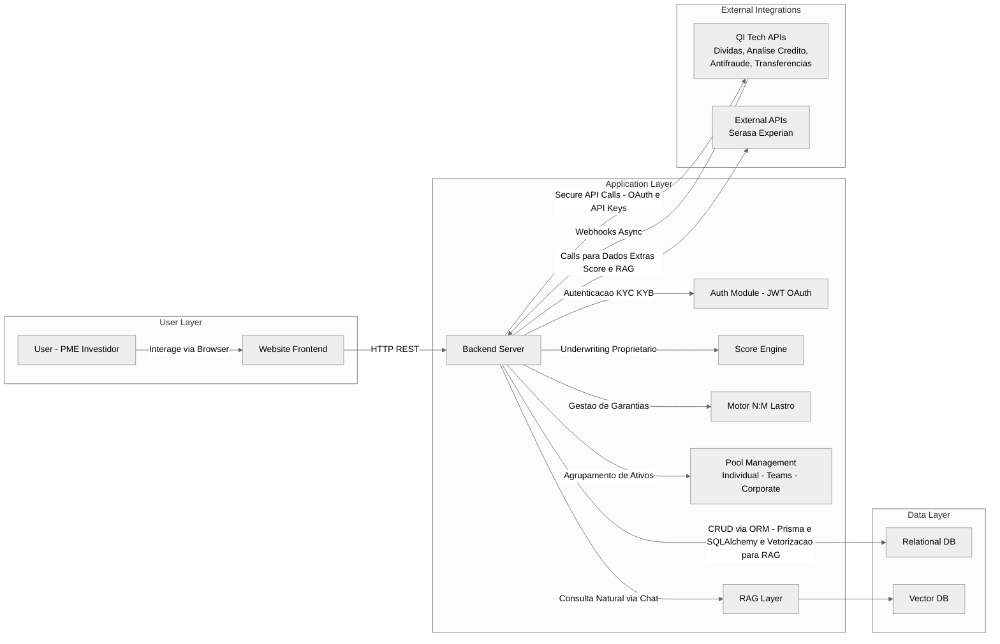

# 🌟 Hackathon QI Tech & W1 - Projeto P2P de Crédito

**Nome do Projeto**: [Insira o nome do projeto]  
**Equipe**: [Nome da equipe]  
**Hackathon**: QI Tech Inovacamp 2025  
**Data da Submissão**: [Data]

---

## 🔗 Sumário

1. [Resumo Executivo & Introdução](#1-resumo-executivo--introdução)  
2. [Problema a Ser Resolvido](#2-problema-a-ser-resolvido)  
3. [Público-Alvo & Personas](#3-público-alvo--personas)  
4. [Análise de Mercado](#4-análise-de-mercado)  
5. [Análise SWOT](#5-análise-swot)  
6. [Visão Geral da Solução](#6-visão-geral-da-solução)  
7. [Arquitetura Técnica](#7-arquitetura-técnica)  
8. [Diferenciais e Inovação](#8-diferenciais-e-inovação)  
9. [Funcionalidades & MVP](#9-funcionalidades--mvp)  
10. [Modelo de Negócios & Monetização](#10-modelo-de-negócios--monetização)  
11. [Estratégia de Go-to-Market](#11-estratégia-de-go-to-market)  
12. [Indicadores de Sucesso & Impacto](#12-indicadores-de-sucesso--impacto)  
13. [Roadmap & Visão de Futuro](#13-roadmap--visão-de-futuro)  
14. [Equipe e Papéis](#14-equipe-e-papéis)  
15. [Referências & Apêndices](#15-referências--apêndices)

---

## 1. Resumo Executivo & Introdução

O CreditFlow é uma plataforma Lending as a Service (LaaS) de crédito P2P lastreado em recebíveis que atua como intermediário tecnológico entre Pequenas e Médias Empresas (PMEs) e investidores. 

Alinhado com a missão da QI Tech de democratizar o acesso ao crédito e oferecer soluções end-to-end, o CreditFlow utiliza a licença de SCD/DTVM (simulada) para estruturar operações de emissão de crédito de forma instantânea e segura. A QI Tech, por ser a primeira SCD aprovada pelo Banco Central no Brasil , oferece a infraestrutura e a cultura tecnológica necessárias para o sucesso desta solução.

Nossa inovação reside no Motor de Lastro de Múltiplos-para-Múltiplos e na experiência do usuário focada em chatbot e WhatsApp, removendo a lentidão e a burocracia do mercado tradicional. O desenvolvimento deste produto coeso envolve um sistema de carteira, infraestrutura Peer to Peer, requisitos de segurança (antifraude) e sistema de score de crédito.

---

## 2. Problema a Ser Resolvido

O CreditFlow é uma solução criada para resolver a ineficiência no mercado de crédito que afeta diretamente as Pequenas e Médias Empresas (PMEs). Este segmento, que impulsiona a economia brasileira ao gerar aproximadamente 30% do Produto Interno Bruto (PIB) (MCKINSEY, 2022), é o mais penalizado pela estrutura de crédito tradicional.

### 2.1. Desafios Atuais do Mercado de Crédito: Centralização, Custo e Lentidão

O sistema financeiro tradicional impõe barreiras significativas que impedem as PMEs de acessarem o capital de giro necessário para crescer:

| Desafio                    | Detalhamento com Dados de Mercado e Foco em PME                                                                                             |
|----------------------------|------------------------------------------------------------------------------------------------------------------------------------------|
| Lentidão e Burocracia na Análise    | O processo de underwriting é desproporcional à necessidade de velocidade das PMEs. Apenas três em cada dez donos de pequenos negócios que buscaram empréstimos conseguiram obter crédito, refletindo a baixa taxa de sucesso e a morosidade do processo (SEBRAE, 2023).  |
| Centralização e Baixa Inclusão       | O crédito para o segmento de PMEs é drasticamente sub-servido, representando historicamente apenas 9% do volume total emprestado no país (MCKINSEY, 2022). Essa concentração afasta as PMEs que não se encaixam no perfil de risco dos grandes bancos.                             |
| Alto Spread e Falta de Garantias Líquidas | O alto custo do crédito é imposto, em parte, pela ineficiência do modelo tradicional (FECOMERCIO, 2025). Além disso, PMEs com bons recebíveis (parcelamentos de clientes, contratos) lutam para usar esse ativo como garantia de forma ágil, pois o sistema é avesso a modelos de lastro flexíveis. |

### 2.2. Especificidades do P2P e os Gargalos de Segurança e Confiabilidade

O modelo Peer-to-Peer (P2P), embora mais eficiente, exige uma solução robusta para proteger as operações de PMEs e o capital dos investidores:
- **Gargalo de Integridade do Lastro:** Para PMEs que cedem recebíveis como garantia, o risco de usar o mesmo ativo em múltiplas transações (duplicidade) é real. A confiança no crédito lastreado depende de uma estrutura tecnológica que garanta o controle da garantia via Registradora.
- **Gargalo de Confiança e Risco:** Investidores que financiam PMEs exigem transparência e validação rigorosa. A plataforma deve ter um Sistema de Score de Crédito que vá além do scoring tradicional (que tende a penalizar PMEs) para construir confiança no ativo P2P.
- **Gargalo de Liquidez (Investidor):** Para atrair capital de investidores qualificados, o dinheiro não pode ficar parado (pledge inativo). A ineficiência de capital afeta a atratividade do modelo P2P.

### 2.3. Valor Agregado da Solução CreditFlow (Foco PME)

O CreditFlow inova ao utilizar tecnologia como um SCD, resolvendo os problemas de lentidão e risco do mercado de PMEs por meio de:

| Inovação do CreditFlow  | Benefício e Impacto para a PME                                                                                                                                                   |
|------------------------|-----------------------------------------------------------------------------------------------------------------------------------------------------------------------------------|
| Decisão Imediata (Score Híbrido) | Permite que a PME saiba em segundos o limite e a taxa de seu crédito lastreado. O Score Híbrido avalia o fluxo de recebíveis, tornando o risco mais justo para empresas que, de outra forma, teriam o crédito negado (SEBRAE, 2023).  |
| Motor de Lastro N:M e Registradora | Oferece flexibilidade máxima para a PME, permitindo que múltiplos recebíveis sirvam de garantia para múltiplos empréstimos. O controle rigoroso, com segurança antifraude, garante a integridade e a confiança no lastro.              |
| Mecanismo de Ativação P2P        | Garante que o Investidor seja atraído pela eficiência de capital, o que se traduz em um custo de captação menor para a PME no longo prazo.                                                                                   |
| UX de Crédito Onipresente         | Transforma o processo de crédito em uma jornada Chatbot/WhatsApp fácil e intuitiva, eliminando a burocracia física e acelerando o acesso ao capital. 

## 3. Público-Alvo & Personas

O CreditFlow atende a um marketplace de duas pontas: a PME Tomadora de Crédito (demandante de capital) e o Investidor Qualificado (provedor de capital).

### 3.1. Público-Alvo Principal: PMEs Lastreadas (Tomador de Crédito)

Focamos em PMEs de Varejo e Serviços com faturamento que exige agilidade e que possuem recebíveis futuros (cartão de crédito, contratos) como garantia.

#### Persona 1: Ana Lúcia – A PME Digital (Tomadora)

| Tópico          | Detalhe                                                                                                         |
|-----------------|----------------------------------------------------------------------------------------------------------------|
| Quem é?         | Dona de um e-commerce de Moda (12 funcionários). Faturamento anual de R$ 1,5 milhão. Vendas concentradas em cartão de crédito e marketplaces. |
| Motivação       | Aproveitar oportunidades de compra de estoque (margem). Precisa de capital de giro hoje para não perder o preço de atacado de amanhã. |
| Dores           | 1. Lentidão do Banco: Processo de 15 dias para análise de crédito.   2. Alto Custo: Taxas injustas para empresas digitais com fluxo de caixa sólido. |
| Como o CreditFlow Ajuda | 1. Decisão em Segundos: Solicitação via Chatbot/WhatsApp com aprovação quase instantânea (Tópico 2.3).   2. Score Híbrido: Valoriza seu fluxo de recebíveis (lastro) para taxas justas. |

### 3.2. Público-Alvo Secundário: Investidores (Credores)

Miramos em indivíduos e instituições que buscam ativos de crédito de alta qualidade, transparência e eficiência de capital.

#### Persona 2: Ricardo – O Alocador Institucional (Credor)

| Tópico          | Detalhe                                                                                                                                            |
|-----------------|----------------------------------------------------------------------------------------------------------------------------------------------------|
| Quem é?         | Gestor de Risco em uma Gestora de Patrimônio Privado (Assets under Management: R$ 500 milhões). Busca alocar capital em crédito privado.             |
| Motivação       | Retorno Ajustado ao Risco: Obter rentabilidade superior à renda fixa tradicional, com segurança de lastro e diversificação de default.               |
| Dores           | 1. Opaquidade de FIDCs: Altas taxas de administração e falta de visibilidade sobre os ativos reais.   2. Inércia de Capital: O capital fica parado (pledge inativo) esperando a formalização dos empréstimos. |
| Como o CreditFlow Ajuda | 1. Transparência & Taxa Fixa: Paga apenas uma taxa administrativa fixa sobre a alocação, garantindo maior yield líquido (Tópico 10).   2. Lastro Certificado: A garantia do recebível registrado (Registradora) e o underwriting rigoroso oferecem segurança jurídica e técnica. |

---

## 4. Análise de Mercado

# 4. Análise de Mercado

A análise de mercado do CreditFlow se baseia na identificação do gap do crédito para PMEs no Brasil, nas tendências regulatórias favoráveis ao modelo P2P e na alavancagem da infraestrutura SCD/DTVM da QI Tech.

## 4.1. Panorama Geral e Oportunidades de Crescimento

O mercado de crédito para Pequenas e Médias Empresas (PMEs) continua a ser o mais sub-servido:

- **Mercado Sub-servido:** O crédito para PMEs representa historicamente apenas 9% do volume total emprestado no país, apesar de o segmento ser crucial para o PIB (MCKINSEY, 2022). Esta concentração em grandes bancos gera uma demanda reprimida por capital rápido e justo.
- **Crescimento do P2P Regulamentado:** A regulamentação pelo Banco Central (BCB, 2022) fomentou o crescimento das Fintechs Lending e do modelo P2P (SEP), que por natureza é mais transparente e eficiente que o spread bancário, atraindo Investidores que buscam yield superior e transparente.
- **Oportunidade do Lastro:** O volume crescente de Recebíveis futuros (cartões, contratos) gerado pela digitalização é o lastro ideal. O compliance regulatório exige o registro e a custódia desses ativos, ambiente onde a QI Tech (com suas soluções de DTVM e Custódia) possui profunda expertise.

## 4.2. Principais Concorrentes e Soluções Similares

Os concorrentes do CreditFlow se dividem em dois grupos, mas a solução se diferencia pela tecnologia de backend e pelo modelo de receita transparente:

| Característica                  | CreditFlow (QI Tech SCD)                                      | Fintechs P2P/SEP (Ex: Nexoos, Ulend)                         | Bancos Tradicionais (Ex: Itaú, Bradesco)                     |
|-------------------------------|--------------------------------------------------------------|------------------------------------------------------------|-------------------------------------------------------------|
| Estrutura Legal                | SCD/DTVM (Infraestrutura All-in-one da QI Tech)              | Geralmente operam como SEP (Sociedade de Empréstimo entre Pessoas) | Bancos Múltiplos                                             |
| Modelo de Receita             | Taxa Fixa Adm. sobre Alocação (Modelo Fee-Based Transparente) | Principalmente Spread (Margem de Juros)                      | Spread bancário, opaco e caro                                |
| Segurança do Lastro           | Motor N:M + Custódia/Registradora. Segurança máxima via APIs de Custódia da QI Tech. | Foco na análise de crédito; gestão de lastro menos flexível. | Alto rigor, mas pouca agilidade.                             |
| Velocidade da Decisão          | Instantânea (Decisão em Segundos via Score Híbrido)           | Rápida (horas a 1-2 dias)                                   | Lenta (dias ou semanas)                                     |

## 4.3. Diferenciais e Inovação

O CreditFlow é inovador e altamente competitivo porque ataca os principais pontos de dor do mercado (lentidão, opacidade e risco de lastro) com o poder tecnológico da QI Tech:

| Diferencial do CreditFlow          | Por que é Inovador                                                            | Vantagem Estratégica                                                                        |
|----------------------------------|-------------------------------------------------------------------------------------------|--------------------------------------------------------------------------------------------|
| Motor de Lastro N:M e SCD/DTVM    | Segurança Incontestável do Ativo: A integração com a Custódia/Registradora da QI Tech elimina o risco de duplicidade de recebíveis. | Atração de Investidores Qualificados (FIDCs) em volume, garantindo o funding para a plataforma (Tópico 10.3). |
| Decisão Imediata via Chatbot       | Experiência do Usuário (UX) Inovadora: Transforma a burocracia do crédito em uma conversa de minutos. | Resolução direta da dor da lentidão que leva a alta taxa de negação de crédito para PMEs (SEBRAE, 2023).          |
| Monetização Asset-Light e Transparente | Alinhamento de Incentivos: Taxa de Alocação transparente e retorno líquido superior para o Credor, sem opacidade do spread bancário. | Escalabilidade Superior: Plataforma cresce com volume de transações, sem depender da alocação do próprio capital (FINRO, 2025). |

---

## 5. Análise SWOT

# 5. Análise SWOT (CreditFlow)

A Análise SWOT (Forças, Fraquezas, Oportunidades e Ameaças) do CreditFlow é fundamental para alinhar a capacidade interna da solução com a realidade externa do mercado de crédito para PMEs e o ecossistema de fintechs.

## 5.1. Forças (Strengths) - Fatores Internos Positivos

As forças são os diferenciais controláveis que garantem a execução e competitividade do CreditFlow no mercado.

| Força                     | Alinhamento com o Modelo de Negócios e a QI Tech                                                                                       |
|---------------------------|---------------------------------------------------------------------------------------------------------------------------------------|
| Arquitetura Asset-Light    | O modelo P2P fee-based e a estrutura SCD garantem que o CreditFlow não precise alocar capital próprio para cada empréstimo, tornando-o inerentemente mais escalável e com menor risco de balanço do que um banco tradicional (PLAI, 2022).|
| Segurança Antifraude e Compliance (Lastro) | O uso da tecnologia de lastro N:M e a integração com a Registradora (Central de Recebíveis) eliminam o risco de duplicidade de garantia, o que é o principal ponto de vulnerabilidade em crédito lastreado.                                |
| Velocidade de Underwriting (Score Híbrido) | Capacidade de entregar uma decisão de crédito em segundos via Chatbot/API, resolvendo o gargalo de lentidão e burocracia do mercado tradicional (SEBRAE, 2023).                                                                               |
| UX Onipresente (Chatbot/WhatsApp) | Interface inovadora que transforma a experiência complexa do crédito em uma jornada simples e acessível, aumentando a taxa de conversão de PMEs.                                                                                |

## 5.2. Fraquezas (Weaknesses) - Fatores Internos Negativos

São os desafios internos que o CreditFlow deve gerenciar e mitigar.

| Fraqueza                    | Estratégia de Mitigação                                                                                                               |
|-----------------------------|--------------------------------------------------------------------------------------------------------------------------------------|
| Dependência Inicial de Funding | No modelo P2P, a plataforma depende de capital de terceiros (Credores) para financiar as PMEs.                                      |
| Custo de Aquisição (CAC) de PMEs | Capturar PMEs que já possuem o fluxo de recebíveis lastreável pode ser caro no início, exigindo convencimento para mudar de provedor de BaaS/Crédito.                                  |
| Risco de Inadimplência do Ativo | Embora o risco de default seja do Credor, a qualidade do Score Híbrido e a taxa de inadimplência afetam diretamente a confiança e a receita da taxa de alocação da plataforma.          |

## 5.3. Oportunidades (Opportunities) - Fatores Externos Positivos

São as tendências de mercado que o CreditFlow pode explorar para crescimento.

| Oportunidade                | Justificativa de Mercado (Dados ABNT)                                                                                                                                |
|----------------------------|--------------------------------------------------------------------------------------------------------------------------------------------------------------------|
| Expansão do Crédito Digital e P2P | A regulamentação pelo Banco Central (BCB, 2022) fomentou o crescimento das fintechs de crédito digital. Há uma clara tendência de migração do crédito do balanço bancário para plataformas asset-light (FINRO, 2025).                   |
| Inclusão Financeira de PMEs         | O segmento de PMEs é drasticamente sub-servido, representando apenas 9% do volume total emprestado (MCKINSEY, 2022). Este é o gap de mercado que o CreditFlow, com seu Score Híbrido, visa capturar.                                         |
| Crescimento do Lastro (Recebíveis) | O aumento do uso de meios de pagamento eletrônicos no Brasil cria um volume crescente e auditável de recebíveis (o lastro). A integração com as registradoras é obrigatória, garantindo um ambiente de compliance favorável.               |
| Ecossistema Open Finance/Data       | O Open Finance facilita o acesso a dados de PMEs com consentimento, permitindo que o Score Híbrido se torne mais preditivo e preciso, diferenciando o CreditFlow de bureaus de crédito tradicionais.                                          |

## 5.4. Ameaças (Threats) - Fatores Externos Negativos

São os riscos do ambiente externo que o CreditFlow não pode controlar.

| Ameaça                      | Impacto no CreditFlow                                                                                                                               |
|-----------------------------|-----------------------------------------------------------------------------------------------------------------------------------------------------|
| Mudanças Regulatórias (BCB) | Novas regras sobre o lastro, o P2P lending ou as taxas de juros (Ex: teto de juros) podem afetar a atratividade do Investidor ou a rentabilidade da PME. |
| Recessão Econômica/Taxa Selic Alta | Aumento da taxa Selic e/ou uma recessão elevam o risco de default das PMEs, o que pode afastar os Credores do mercado P2P.                                                          |
| Concorrência de Big Techs   | Grandes empresas de tecnologia ou e-commerce que já possuem o dado transacional da PME (e-commerce, marketplaces) podem oferecer crédito embedded e competir diretamente.                                  |

---

## 6. Visão Geral da Solução

O CreditFlow é uma plataforma de Lending as a Service (LaaS) construída sobre a infraestrutura All-in-one da QI Tech. A solução propõe um produto coeso, que integra a experiência do usuário, a gestão de ativos de crédito e a fundação regulatória da SCD/DTVM.

A essência da solução é conectar PMEs a Investidores por meio de um motor de lastro seguro e um processo de underwriting instantâneo, utilizando a tecnologia modular da QI Tech.

### 6.1. A Infraestrutura P2P Coesa: Os 4 Pilares da QI Tech

A solução CreditFlow utiliza a estrutura da QI Tech (primeira SCD aprovada pelo Banco Central no Brasil) para garantir velocidade, compliance e segurança em cada etapa da operação:

| Pilar da Solução          | Módulo QI Tech Integrado       | Como Funciona na Solução CreditFlow                                                                                           |
|---------------------------|-------------------------------|-------------------------------------------------------------------------------------------------------------------------------|
| 1. Sistema de Carteira     | BaaS (Banking as a Service)   | Fornece a conta digital para a PME. É onde o desembolso do empréstimo acontece e onde os recebíveis lastreados são liquidados. Permite que a PME use a conta para transações diárias (PIX, TED), aumentando o stickiness. |
| 2. Infraestrutura P2P (LaaS) | Lending as a Service (LaaS) e DTVM | Gerencia a emissão e a formalização dos títulos de crédito (CCIs/CCEs), conectando diretamente o Investidor ao Tomador. A Custódia e Administração (DTVM) são usadas para gerenciar as Pools de Investimento e o fluxo de pagamento. |
| 3. Segurança (Antifraude) | Risk Solutions                | Ativa o antifraude transacional no onboarding e na solicitação de crédito. O Motor de Regras valida a integridade da PME e checa duplicidade e origem dos recebíveis, protegendo os R$ 20 bilhões em transações digitais que a QI Tech já protegeu. |
| 4. Score de Crédito       | Motor de Crédito (Risk Solutions) | Hospeda o Score Híbrido proprietário do CreditFlow. O motor consome dados tradicionais e fluxo de recebíveis da PME para entregar underwriting em segundos, permitindo operações de crédito rápidas.                           |

### 6.2. Motor de Lastro N:M e o Diferencial de Segurança

O Motor de Lastro Múltiplos-para-Múltiplos (N:M) é o coração da inovação do CreditFlow:

- **Problema Resolvido:** O gargalo do crédito lastreado é a rigidez (1 ativo por 1 empréstimo) e o risco de duplicidade.
- **Solução CreditFlow:** O motor N:M, baseado na integração com as APIs de Custódia da QI Tech, permite que múltiplos recebíveis da PME sirvam como garantia para múltiplos empréstimos de credores diferentes. A integração com a Registradora (via DTVM da QI Tech) garante a integridade e rastreabilidade do ativo, eliminando o risco de duplicidade e aumentando a confiança do investidor.

### 6.3. Visão do Cliente (Front-End)

A arquitetura back-end robusta permite um front-end de altíssima velocidade e conversão:

- **Tomador (PME):** Interage via Chatbot/WhatsApp para solicitar o crédito. A PME insere o valor e, quase instantaneamente, a API do Motor de Crédito (QI Tech) retorna a proposta.
- **Credor (Investidor):** Acessa um dashboard com as Pools de Ativos (recebíveis) curadas pelo Score Híbrido. O Mecanismo de Ativação P2P garante que seu capital só seja ativado após a contratação formal da PME, otimizando a liquidez e a eficiência de capital.

## 7. Arquitetura Técnica

###  Arquitetura 

Para o Mutual, um marketplace P2P de crédito lastreado em recebíveis para PMEs, a arquitetura proposta tem como objetivo ser simples e escalável. 

Criaremos uma aplicação web responsiva, backend para lógica de negócio e integrações externas. 
Partindo da filosofia KISS (Keep It Simple, Stupid) que diz que design de sistemas devem ser simples ao máximo, evitando complexidade desnecessária, propomos uma estrutura monolítica inicial, com possibilidade de evoluir para microsserviços.

A arquitetura segue o padrão em camadas: User Layer (interface), Application Layer (lógica), Data Layer (armazenamento) e External Integrations (APIs QI Tech e outras). Propomos o uso de tecnologias acessíveis: Nextjs para frontend, Node.js ou Python para backend, e deployment em cloud, pois tais tecnologias são amplamente adotadas, possuem vasta documentação e comunidade ativa, facilitando o desenvolvimento rápido e a manutenção.

### Implementação do RAG (Retrieval-Augmented Generation)

A implementação do RAG (Retrieval-Augmented Generation) na plataforma CreditFlow é uma inovação chave para otimizar a experiência do usuário, especialmente para Pequenas e Médias Empresas (PMEs) que buscam crédito. O RAG integra recuperação de informações baseada em vetores com modelos de linguagem generativos (LLMs), permitindo que o sistema processe consultas naturais das PMEs sobre suas necessidades de empréstimo. Por exemplo, uma PME pode descrever via chatbot ou WhatsApp: "Preciso de R$50.000 para comprar estoque, baseado nos meus recebíveis de cartões do último mês." O RAG então busca na base de dados interna (como histórico de transações, recebíveis e scores de crédito) para recuperar contextos relevantes e gerar propostas personalizadas de empréstimo, integrando-se ao motor de score híbrido e ao underwriting instantâneo.

**Componentes do RAG**
1. **Base de Conhecimento (Vector Database):** Uma base de dados vetorial (ex.: Pinecone, FAISS ou PostgreSQL com pgvector) que armazena embeddings de dados estruturados e não-estruturados da PME, incluindo históricos de recebíveis (da tabela receivable), scores de crédito (da tabela company), empréstimos passados (da tabela loan) e perfis de personas (como fluxos de caixa e necessidades sazonais). 
2. **Mecanismo de Recuperação (Embedding Model e Similarity Search):** Utiliza modelos de embedding como Sentence Transformers ou OpenAI Embeddings para converter consultas da PME (descrições textuais de necessidades de empréstimo) em vetores. A busca de similaridade (ex.: cosine similarity ou k-NN) recupera os top-k itens relevantes da base vetorial, filtrando por critérios como data de vencimento de recebíveis ou score de risco. Isso permite buscas semânticas avançadas, indo além de keywords para entender intenções como "capital de giro para expansão" e mapear para dados históricos da PME.
3. **Modelo de Linguagem (LLM):** Um LLM fine-tuned (ex.: Grok, GPT-4 ou Llama) que recebe o contexto recuperado e gera respostas personalizadas. Para uma PME descrevendo suas necessidades, o LLM pode outputar: "Baseado nos seus R\$100.000 em recebíveis pendentes (recuperados da base), você qualifica para um empréstimo de R$60.000 a 1,5% a.m., com lastro N:M ativado." 
4. **Interface de Usuário (Chatbot):** A PME descreve suas necessidades via interfaces conversacionais, tornando o processo intuitivo e acessível. O RAG processa a entrada natural, recupera dados da base (ex.: via query embedding) e retorna respostas em linguagem simples, com opções de aprovação imediata.
5. **Segurança e Conformidade:** Todos os dados recuperados respeitam LGPD via anonimização de embeddings e consentimento explícito. Proteções contra prompt injection e rate limiting evitam abusos, enquanto auditorias garantem que respostas baseadas em RAG não violem regras regulatórias do BCB.

**Vantagens na utilizacao da arquitetura RAG**

1. **Eficiência Operacional:** Automatiza o underwriting inicial, reduzindo tempo de decisão de dias para segundos, alinhando-se ao diferencial de "decisão imediata" do CreditFlow. Buscas semânticas lidam com variações linguísticas (ex.: "capital para estoque" vs. "funding para compras"), melhorando a UX para usuários não-técnicos.
2. **Escalabilidade e Custo-Efetividade:** Vector databases permitem buscas rápidas em grandes volumes de dados sem queries SQL caras. Para uma plataforma como CreditFlow, isso escala com o crescimento de PMEs sem aumentar custos lineares, suportando milhares de consultas diárias.
3. **Segurança e Compliance:** Embeddings anonimizados e recuperação controlada minimizam riscos de vazamento de dados sensíveis, atendendo LGPD e regulamentações do BCB para fintechs P2P.

### 📄 Estrutura do Banco de Dados

Para suportar a solução de empréstimo P2P para PMEs, o banco de dados foi projetado para armazenar informações essenciais sobre empresas, sócios, endereços, contatos, usuários, empréstimos, recebíveis e investidores. A seguir está a estrutura detalhada do banco de dados com as tabelas principais e seus respectivos campos.

## **Tabela company**  
Guarda as informações cadastrais e financeiras principais da empresa.  
- `id` → PK  
- `user_id` → FK → user (dono/representante da empresa no sistema)  
- `address_id` → FK → address (endereço principal da empresa)  
- `corporate_name` → Razão social da empresa  
- `trade_name` → Nome fantasia  
- `cnpj` → Cadastro Nacional de Pessoa Jurídica  
- `legal_nature` → Natureza jurídica (LTDA, SA, EI, etc.)  
- `company_size` → Porte da empresa (micro, small, medium)  
- `opening_date` → Data de abertura  
- `registration_status` → Situação cadastral (active, suspended, closed)  
- `tax_regime` → Regime tributário (Simple National, Presumed Profit, Real Profit)  
- `estimated_annual_revenue` → Receita anual estimada  
- `actual_annual_revenue` → Receita anual real  
- `score` → Score de crédito/avaliação de risco  
- `created_at` → Data de criação do registro  
- `updated_at` → Data da última atualização  

## **Tabela cnae**  
Registra os códigos de atividades econômicas da empresa.  
- `id` → PK  
- `company_id` → FK → company  
- `cnae_code` → Código da atividade econômica  
- `cnae_type` → Tipo de atividade (primary, secondary)  

## **Tabela partner**  
Armazena os sócios e sua participação na empresa.  
- `id` → PK  
- `company_id` → FK → company  
- `cpf_cnpj` → Documento do sócio (pessoa física ou jurídica)  
- `name` → Nome do sócio  
- `ownership_percentage` → Percentual de participação  
- `partner_type` → Tipo de sócio (administrator, shareholder, etc.)  

## **Tabela address**  
Informações de endereço da empresa ou usuários.  
- `id` → PK  
- `street` → Logradouro  
- `number` → Número  
- `complement` → Complemento  
- `district` → Bairro  
- `city` → Cidade  
- `state` → Estado  
- `postal_code` → CEP  

---

## **Tabela contact**  
Registra formas de contato de uma empresa.  
- `id` → PK  
- `company_id` → FK → company  
- `email` → Email de contato  
- `phone` → Telefone  
- `contact_person` → Pessoa responsável pelo contato  

## **Tabela user**  
Representa usuários do sistema (investidores, administradores, donos de empresa).  
- `id` → PK  
- `name` → Nome completo  
- `email` → Email  
- `cpf` → CPF do usuário  
- `address_id` → FK → address  
- `type` → Tipo de usuário (investor, admin, company_owner, etc.)  
- `created_at` → Data de criação do registro  
- `updated_at` → Data da última atualização  

## **Tabela loan**  
Registra empréstimos concedidos às empresas.  
- `id` → PK  
- `company_id` → FK → company (empresa devedora)  
- `loan_number` → Número/código do empréstimo  
- `loan_date` → Data do empréstimo  
- `principal_amount` → Valor principal emprestado  
- `interest_rate` → Taxa de juros aplicada  
- `term_months` → Prazo em meses  
- `currency` → Moeda do empréstimo  
- `status` → Status (active, paid, default)  
- `collateral_type` → Tipo de garantia (receivables, property, etc.)  
- `collateral_value` → Valor total da garantia  
- `created_at` → Data de criação  
- `updated_at` → Data de atualização  

## **Tabela loan_receivable**  
Tabela de associação entre empréstimos e recebíveis usados como garantia.  
- `id` → PK  
- `loan_id` → FK → loan  
- `receivable_id` → FK → receivable  
- `linked_amount` → Valor do recebível vinculado ao empréstimo  
- `status` → Status da vinculação (active, paid, released)  
- `created_at` → Data de criação  
- `updated_at` → Data de atualização  

## **Tabela receivable**  
Registra os recebíveis da empresa.  
- `id` → PK  
- `company_id` → FK → company  
- `invoice_number` → Número da fatura/documento  
- `issue_date` → Data de emissão  
- `due_date` → Data de vencimento  
- `amount` → Valor do recebível  
- `currency` → Moeda (ex: BRL, USD)  
- `status` → Status (pending, paid, overdue)  
- `description` → Observações do recebível  
- `created_at` → Data de criação  
- `updated_at` → Data de atualização  

## **Tabela loan_investor**  
Representa a participação de investidores em empréstimos, comprando cotas.  
- `id` → PK  
- `loan_id` → FK → loan  
- `user_id` → FK → user (investidor)  
- `created_at` → Data da participação  
- `updated_at` → Última atualização  

### **Considerações de Segurança**  
Segurança é primordial em plataformas financeiras P2P, onde vazamentos podem resultar em perdas financeiras ou violações regulatórias. Durante o desenvolvimento do produto diversos fatores serão ponderados durante o denvolvimento da aplicação, incluindo:

- **Autenticação e Autorização:** Usar JWT com refresh tokens e MFA (Multi-Factor Authentication) para prevenir acessos não autorizados, já que ataques como credential stuffing representam 80% das brechas financeiras  
- **Criptografia de Dados:** Dados sensíveis (ex.: CPF, histórico financeiro) criptografados em trânsito (TLS 1.3) e em repouso (AES-256). Para RAG, embeddings anonimizados evitam exposição de PII (Personally Identifiable Information). Para lidar com a conformidade LGPD, é necessário implementar consentimento explícito para uso de dados no chat, com auditorias regulares.
- **Proteção contra Ataques:** Rate limiting no chat para evitar DDoS; WAF (Web Application Firewall) como AWS Shield. Para RAG, validar inputs para prevenir injeções de prompt (prompt injection attacks), comuns em LLMs. 

## 8. Diferenciais e Inovação

- Pontos que destacam a solução no mercado.
- Uso de tecnologia de ponta ou ideias inovadoras de segurança/UX.
- Como a solução atende requisitos de escalabilidade, segurança e compliance.

## 9. Funcionalidades & MVP

- Funcionalidades essenciais para o MVP.
- Funcionalidades exploratórias para fases futuras.
- Requisitos de usabilidade e segurança.

## 10. Modelo de Negócios & Monetização

O modelo de negócios do CreditFlow é estruturado como um Marketplace de Ativos de Crédito P2P Lastreado (SCD), com foco na eficiência transacional e na curadoria de ativos para o Investidor. Nossa rentabilidade é garantida por um modelo fee-based (baseado em taxas), que é mais escalável e transparente que o spread tradicional.

### 10.1. Fontes de Receita Previstas (Modelo Múltiplo)

A escolha de monetizar o CreditFlow via uma taxa fixa administrativa cobrada ao Investidor (Credor) sobre o valor alocado, em vez de lucrar com o spread de juros, confere duas vantagens competitivas críticas no mercado de crédito digital: maior transparência e escalabilidade superior (PLAI, 2022).

#### A. Transparência

O modelo fee-based promove a transparência ao separar claramente o custo do serviço do risco do ativo.

| Fator de Transparência | Justificativa e Dado de Mercado |
|-----------------------|---------------------------------|
| Opaquidade do Spread  | Nos bancos tradicionais, o spread é uma margem opaca, onde o custo de captação, o custo operacional e o lucro da instituição se misturam. Essa falta de clareza é uma das críticas centrais aos bancos, o que leva a uma taxa de juros média alta e variável (BCB, 2022). |
| Clareza da Taxa Fixa  | O CreditFlow comunica ao Investidor (Credor) o Rendimento Bruto do ativo lastreado e, separadamente, a Taxa de Alocação da plataforma. Essa taxa representa o custo de curadoria, underwriting e tecnologia. Plataformas P2P ganham confiança ao exibir de forma clara a taxa de juros aplicada, tarifas cobradas e o Custo Efetivo Total (CET), o que é um diferencial significativo para investidores (WEALTH MONEY, 2025). |
| Preços Competitivos    | Ao competir com a taxa de administração de fundos tradicionais (que podem ser elevadas), o modelo fee-based do CreditFlow é estruturado para garantir que o retorno líquido final do Credor seja superior (BCB, 2022), atraindo capital institucional de maneira mais eficiente. |

#### B. Escalabilidade (Modelo Asset-Light)

A escalabilidade é o maior benefício desse modelo de SCD (fee-based), pois a plataforma não precisa comprometer seu próprio capital.

| Fator de Escalabilidade | Justificativa e Dado de Mercado |
|------------------------|---------------------------------|
| Alívio do Balanço (Asset-Light) | Diferente do modelo de spread (onde a SCD precisa financiar o empréstimo com recursos próprios ou captações caras, tornando-o asset-heavy), no P2P a plataforma é apenas uma facilitadora que conecta o capital do Investidor à PME (BCB, 2022). |
| Crescimento Baseado em Volume | A receita do CreditFlow escala diretamente com o volume de transações (alocação de capital), e não com a margem de juros individual. Modelos baseados em taxas de transação — como os de payment processors ou marketplace — são os que mais se beneficiam do alto volume de uso, sendo intrinsecamente mais escaláveis (FINRO, 2025). |
| Otimização do Custo de Capital | O risco de default é primariamente do Investidor (no modelo P2P), não do CreditFlow. Isso permite à plataforma manter o foco total na tecnologia (Score Híbrido, Antifraude) e na atração de funding (Credores), sem se preocupar em alocar capital próprio para cada novo empréstimo, facilitando o crescimento rápido em um mercado de PMEs sub-atendido (MCKINSEY, 2022). |

### 10.2. Estratégia para Captação e Retenção de Usuários

A estratégia foca na velocidade da oferta e na fidelização pelo BaaS:

#### A. Captação (Tomadores - PMEs)

- Proposta de Valor Central: Promessa de decisão de crédito em segundos via Chatbot, resolvendo a dor de mercado da lentidão (SEBRAE, 2023).
- Parceria com Adquirência/ERPs: Foco em PMEs que utilizam soluções de adquirência (maquininhas de cartão) ou ERPs, que já possuem os dados de recebíveis. A parceria direta com essas empresas (os Integradores) é o canal mais eficiente e de menor custo de aquisição (CAC).

#### B. Retenção (Tomadores e Investidores)

- Estratégia BaaS (Stickiness): A PME é incentivada a usar a Carteira Digital do CreditFlow como sua conta principal para receber pagamentos e realizar transações B2B, devido à tarifa competitiva sobre depósitos (Fonte 10.1). Isso aumenta o Lifetime Value (LTV) do cliente.
- Eficiência de Capital (Investidor): A retenção de Investidores é garantida pelo Mecanismo de Ativação P2P, que assegura que o capital parado (pledge inativo) seja mínimo, entregando maior eficiência e retorno ajustado ao risco.

### 10.3. Parcerias Estratégicas (Aceleração de Crescimento)

O CreditFlow alavancará a infraestrutura da SCD/DTVM para construir um ecossistema de parcerias:

- **Parceiros de Dados e KYC/Antifraude:**  
  - Serasa/Big Data: Para alimentar o Motor de Score Híbrido e garantir o compliance de dados.  
  - Empresas Antifraude: Utilizar soluções externas e internas para garantir a segurança no onboarding e nas transações (QI Tech, 2025).

- **Parceiros de Distribuição (Integradores):**  
  - Adquirentes e ERPs: Empresas de gestão de recebíveis e software de PDV/Varejo. Integrar o CreditFlow diretamente ao dashboard dessas PMEs permite oferecer o crédito de forma contextualizada (crédito embarcado).

- **Parceiros de Liquidez (Investidores Corporativos):**  
  - Gestoras de Patrimônio e Fundos de Investimento em Direitos Creditórios (FIDCs): Oferecer as Pools de Investimento do CreditFlow como um ativo qualificado para Fundos que buscam alocação em crédito privado com baixo risco (devido ao lastro registrado).

---

Com o modelo de negócios validado, o CreditFlow estará preparado para avançar para a análise SWOT e demais etapas estratégicas do projeto.

---

## 11. Estratégia de Go-to-Market

- Ações iniciais para lançamento e validação.
- Parcerias e canais de distribuição.
- Planos para escalabilidade e crescimento.

---

## 12. Indicadores de Sucesso & Impacto

- KPIs que medirão o sucesso do projeto (ex: volume de crédito processado, usuários ativos, inadimplência).
- Impacto esperado para o mercado e para os usuários.
- Métricas qualitativas e quantitativas.

---

## 13. Roadmap & Visão de Futuro

- Cronograma de desenvolvimento e entregas.
- Marcos importantes do projeto.
- Visão de longo prazo para o produto e expansão.

---

## 14. Equipe e Papéis

| Nome | Papel | Competências Principais |
|-------|-------|----------------------|
| [Nome1] | Líder Técnico | [Ex: Backend, APIs, segurança] |
| [Nome2] | Desenvolvedor Frontend | [Ex: Mobile, UX/UI] |
| [Nome3] | Analista de Negócios | [Ex: Mercado financeiro, crédito] |

- Pequenas descrições ou experiências relevantes da equipe.

---

## 15. Referências & Apêndices

BCB. Banco Central do Brasil. Fintechs de empréstimos P2P: características e aspectos competitivos. Relatório de Economia Bancária, Boxe 5. Brasília, 2022. Disponível em: https://www.fecomercio.com.br/noticia/sinais-de-alerta-a-tomada-de-credito-pelas-empresas.

FECOMERCIO. Sinais de alerta à tomada de crédito pelas empresas. São Paulo, 2025. Disponível em: https://www.fecomercio.com.br/noticia/sinais-de-alerta-a-tomada-de-credito-pelas-empresas.

MCKINSEY. O novo normal do crédito para PME: desafios, tendências e inovações. São Paulo, 2022. Disponível em: https://www.mckinsey.com/br/our-insights/all-insights/o-novo-normal-do-credito-para-pme.

SEBRAE. Crédito negado: apenas 3 de cada 10 empresários que buscam empréstimo têm sucesso. ASN Nacional. Brasília, 2023. Disponível em: https://agenciasebrae.com.br/dados/credito-negado-apenas-3-de-cada-10-empresarios-que-buscam-emprestimo-tem-sucesso/.

SEBRAE. Pesquisa MEIs Em Foco: Os Desafios Reais De Quem Empreende No Brasil. Curitiba, 2025. Disponível em: https://sebraepr.com.br/impulsiona/meis-em-foco-os-desafios-reais-de-quem-empreende-no-brasil/?srsltid=AfmBOoqtZy9ymX7LHWEH6IBVZc_dul6JZcTbLOiTm1ZcqB8K3Dkf84wi .https://sebraepr.com.br/impulsiona/meis-em-foco-os-desafios-reais-de-quem-empreende-no-brasil/?srsltid=AfmBOoqtZy9ymX7LHWEH6IBVZc_dul6JZcTbLOiTm1ZcqB8K3Dkf84wi

BCB. Banco Central do Brasil. Fintechs de empréstimos P2P: características e aspectos competitivos. Relatório de Economia Bancária, Boxe 5. Brasília, 2022. Disponível em: [Inserir URL ou Local de Acesso].

FINRO. Fintech Valuation Multiples: 2025 Insights & Trends. Finro Financial Consulting, 2025. Disponível em: [Inserir URL ou Local de Acesso].

MCKINSEY. O novo normal do crédito para PME: desafios, tendências e inovações. São Paulo, 2022. Disponível em: [Inserir URL ou Local de Acesso].

PLAI. How does fintech make money? 9 business models explained. Plaid Resources, 2022. Disponível em: [Inserir URL ou Local de Acesso].

WEALTH MONEY. P2P Lending vs. crédito bancário: entenda as diferenças para quem investe e para quem precisa de empréstimo. São Paulo, 2025. Disponível em: [Inserir URL ou Local de Acesso].

Esta seção lista as referências externas utilizadas para embasar a análise de mercado, o problema e o modelo de negócios do CreditFlow, conforme a norma ABNT NBR 6023:

BANCO CENTRAL DO BRASIL (BCB). Fintechs de empréstimos P2P: características e aspectos competitivos. Relatório de Economia Bancária, Boxe 5. Brasília, 2022. Disponível em: https://www.bcb.gov.br/pec/wps/ingl/wps571.pdf. Acesso em: 29 set. 2025.

FECOMERCIO. Sinais de alerta à tomada de crédito pelas empresas. São Paulo, 2025. Disponível em: https://www.fecomercio.com.br/noticia/sinais-de-alerta-a-tomada-de-credito-pelas-empresas. Acesso em: 29 set. 2025.

FINRO. Fintech Valuation Multiples: 2025 Insights & Trends. Finro Financial Consulting, 2025. Disponível em: https://www.finrofca.com/news/fintech-revenue-multiples-2025. Acesso em: 29 set. 2025.

MCKINSEY & COMPANY. O novo normal do crédito para PME: desafios, tendências e inovações. São Paulo, 2022. Disponível em: https://www.mckinsey.com/br/our-insights/all-insights/o-novo-normal-do-credito-para-pme. Acesso em: 29 set. 2025.

PLAI. How does fintech make money? 9 business models explained. Plaid Resources, 2022. Disponível em: https://plaid.com/resources/fintech/how-does-fintech-and-plaid-make-money/. Acesso em: 29 set. 2025.

SEBRAE. Crédito negado: apenas 3 de cada 10 empresários que buscam empréstimo têm sucesso. ASN Nacional. Brasília, 2023. Disponível em: https://agenciasebrae.com.br/dados/credito-negado-apenas-3-de-cada-10-empresarios-que-buscam-emprestimo-tem-sucesso/. Acesso em: 29 set. 2025.

WEALTH MONEY. P2P Lending vs. crédito bancário: entenda as diferenças para quem investe e para quem precisa de empréstimo. São Paulo, 2025. Disponível em: https://wealthmoney.com.br/p2p-lending-vs-credito-bancario-entenda-as-diferencas-para-quem-investe-e-para-quem-precisa-de-emprestimo/. Acesso em: 29 set. 2025.

---
